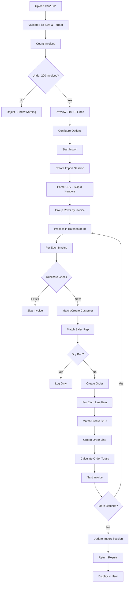

# Sales Report Import System - Complete Technical Guide

## Overview

This guide provides comprehensive instructions for implementing and operating the Sales Report Import system. This system allows administrators to import historical sales data from CSV files into the database, automatically creating and matching customers, products, SKUs, suppliers, orders, and order lines.

---

## Table of Contents

1. [System Architecture](#system-architecture)
2. [CSV Format Specification](#csv-format-specification)
3. [Database Schema](#database-schema)
4. [Edge Function Implementation](#edge-function-implementation)
5. [UI Implementation](#ui-implementation)
6. [Supabase Configuration](#supabase-configuration)
7. [Import Process Flow](#import-process-flow)
8. [Error Handling](#error-handling)
9. [Best Practices](#best-practices)
10. [Troubleshooting](#troubleshooting)

---

## System Architecture

### Components

1. **Frontend UI** (`src/pages/admin/SalesReportImport.tsx`)
   - File upload interface
   - CSV preview
   - Import settings (skip duplicates, dry run)
   - Progress tracking
   - Results display

2. **Edge Function** (`supabase/functions/import-sales-report/index.ts`)
   - CSV parsing with quote handling
   - Batch processing (50 invoices per batch)
   - Customer/SKU/Product matching and creation
   - Order and order line creation
   - Import session tracking

3. **Database Tables**
   - `import_sessions` - Tracks import history
   - `import_customer_mappings` - Maps CSV customer names to database IDs
   - `import_salesrep_mappings` - Maps CSV salesperson names to database IDs
   - `customer`, `order`, `orderline`, `product`, `skus`, `suppliers` - Core data tables

---

## CSV Format Specification

### File Requirements

- **Format**: CSV (Comma-Separated Values)
- **Encoding**: UTF-8
- **File Size Limit**: 20MB
- **Invoice Limit**: Maximum 200 invoices per file to avoid timeout
- **Header Lines**: First 3 lines are skipped (metadata/headers)
- **Data Start**: Line 4 onwards

### CSV Column Structure

The CSV must contain the following 26 columns in this exact order:

| Column # | Field Name | Description | Required | Example |
|----------|------------|-------------|----------|---------|
| 1 | Invoice Number | Unique invoice identifier | Yes | "INV-2024-001" |
| 2 | Invoice Date | Date invoice was created | Yes | "2024-01-15" |
| 3 | Posted Date | Date invoice was posted | No | "2024-01-16" |
| 4 | Due Date | Payment due date | No | "2024-02-15" |
| 5 | Purchase Order | Customer PO number | No | "PO-12345" |
| 6 | Delivery Start | Delivery window start | No | "2024-01-20" |
| 7 | Delivery End | Delivery window end | No | "2024-01-22" |
| 8 | Special Instructions | Delivery notes | No | "Call before delivery" |
| 9 | Status | Order status | Yes | "Delivered" or "Pending" |
| 10 | Customer | Customer name | Yes | "ABC Wine Bar" |
| 11 | Salesperson | Sales rep name | No | "John Smith" |
| 12 | Shipping Address 1 | Street address line 1 | No | "123 Main St" |
| 13 | Shipping Address 2 | Street address line 2 | No | "Suite 100" |
| 14 | Shipping City | City | No | "San Francisco" |
| 15 | Shipping Province | State/Province | No | "CA" |
| 16 | Shipping Country | Country | No | "United States" |
| 17 | Shipping Postal | Zip/Postal code | No | "94102" |
| 18 | Item Number | Internal item reference | No | "ITEM-001" |
| 19 | SKU | Stock Keeping Unit code | Yes | "CABSAUV-750ML" |
| 20 | Item | Product name | Yes | "Cabernet Sauvignon 2020" |
| 21 | Supplier | Supplier/Producer name | Yes | "Napa Valley Winery" |
| 22 | Qty | Quantity (bottles) | Yes | "12" |
| 23 | Cases | Number of cases | No | "1" |
| 24 | Liters | Total liters | No | "9.0" |
| 25 | Unit Price | Price per unit | Yes | "25.00" |
| 26 | Net Price | Total line price | Yes | "300.00" |

### CSV Formatting Rules

1. **Multi-line Fields**: Use double quotes for fields containing commas or line breaks
   ```csv
   "ABC Wine Bar","Special instructions:
   Call before delivery"
   ```

2. **Escaped Quotes**: Double quotes within quoted fields must be escaped with another quote
   ```csv
   "Customer name with ""quotes"" inside"
   ```

3. **Numeric Values**: Can include commas (will be parsed out)
   ```csv
   "1,250.00"
   ```

4. **Date Format**: Accepts common date formats, parsed by JavaScript `Date` constructor
   - "2024-01-15"
   - "01/15/2024"
   - "January 15, 2024"

### Sample CSV Structure

```csv
Header Line 1
Header Line 2
Header Line 3
INV-001,2024-01-15,2024-01-16,2024-02-15,PO-12345,2024-01-20,2024-01-22,"Call first",Delivered,"ABC Wine Bar","John Smith","123 Main St","Suite 100","San Francisco","CA","United States","94102",ITEM-001,CABSAUV-750ML,"Cabernet Sauvignon 2020","Napa Valley Winery",12,1,9.0,25.00,300.00
INV-001,2024-01-15,2024-01-16,2024-02-15,PO-12345,2024-01-20,2024-01-22,"Call first",Delivered,"ABC Wine Bar","John Smith","123 Main St","Suite 100","San Francisco","CA","United States","94102",ITEM-002,CHARD-750ML,"Chardonnay 2021","Sonoma Winery",6,0.5,4.5,30.00,180.00
```

---

## Database Schema

### Core Tables Used

#### `import_sessions`
Tracks each import operation with results and errors.

```sql
CREATE TABLE import_sessions (
  id UUID PRIMARY KEY DEFAULT gen_random_uuid(),
  tenantid UUID NOT NULL,
  user_id UUID,
  filename TEXT,
  import_type TEXT NOT NULL,
  status TEXT NOT NULL DEFAULT 'in_progress',
  settings JSONB,
  started_at TIMESTAMPTZ NOT NULL DEFAULT now(),
  completed_at TIMESTAMPTZ,
  total_rows INTEGER,
  successful_rows INTEGER DEFAULT 0,
  failed_rows INTEGER DEFAULT 0,
  skipped_rows INTEGER DEFAULT 0,
  summary JSONB,
  error_log JSONB,
  created_at TIMESTAMPTZ NOT NULL DEFAULT now()
);
```

#### `import_customer_mappings`
Maps CSV customer names to database customer IDs for consistent matching.

```sql
CREATE TABLE import_customer_mappings (
  id UUID PRIMARY KEY DEFAULT gen_random_uuid(),
  tenantid UUID NOT NULL,
  csv_customer_name TEXT NOT NULL,
  customer_id UUID NOT NULL,
  created_at TIMESTAMPTZ NOT NULL DEFAULT now()
);
```

#### `import_salesrep_mappings`
Maps CSV salesperson names to database sales rep IDs.

```sql
CREATE TABLE import_salesrep_mappings (
  id UUID PRIMARY KEY DEFAULT gen_random_uuid(),
  tenantid UUID NOT NULL,
  csv_salesperson_name TEXT NOT NULL,
  salesrep_id UUID NOT NULL,
  created_at TIMESTAMPTZ NOT NULL DEFAULT now()
);
```

#### `order`
Main orders table with import session tracking.

```sql
ALTER TABLE "order" ADD COLUMN import_session_id UUID;
```

### Tenant Isolation

All tables use Row Level Security (RLS) with tenant isolation:

```sql
CREATE POLICY "tenant_isolation_[table]" ON [table]
  FOR ALL USING (tenantid = get_user_tenant());
```

---

## Edge Function Implementation

### Location
`supabase/functions/import-sales-report/index.ts`

### Configuration
In `supabase/config.toml`:

```toml
[functions.import-sales-report]
verify_jwt = true
```

### Environment Variables Required

The edge function automatically has access to:
- `SUPABASE_URL` - Your Supabase project URL
- `SUPABASE_SERVICE_ROLE_KEY` - Service role key for admin operations
- `SUPABASE_ANON_KEY` - Anonymous key (not used in this function)

### Key Functions

#### 1. `parseCSVLine(line: string): string[]`
Parses a CSV line with proper handling of:
- Quoted fields
- Escaped quotes (`""`)
- Commas within quotes
- Multi-line fields

#### 2. `matchOrCreateCustomer(supabase, tenantId, row): Promise<string | null>`
Logic:
1. Check `import_customer_mappings` table for existing mapping
2. If not found, search `customer` table by name (case-insensitive)
3. If not found, create new customer with address from CSV
4. Save mapping for future imports
5. Return customer ID

#### 3. `matchSalesRep(supabase, tenantId, salespersonName): Promise<string | null>`
Logic:
1. Check `import_salesrep_mappings` table
2. If not found, search `profile` table by first/last name
3. Find associated `salesreps` record
4. Save mapping
5. Return sales rep ID (or null if not found)

#### 4. `matchOrCreateSKU(supabase, tenantId, row): Promise<string | null>`
Logic:
1. Search `skus` table by SKU code
2. If not found:
   - Match or create supplier by name
   - Match or create product by item name
   - Create new SKU with product and supplier
3. Return SKU ID

#### 5. `matchOrCreateSupplier(supabase, tenantId, supplierName): Promise<string | null>`
Logic:
1. Search `suppliers` table by name (case-insensitive)
2. If not found, create new supplier
3. Return supplier ID

### Batch Processing

To prevent timeouts, invoices are processed in batches:

```typescript
const BATCH_SIZE = 50;
const invoiceEntries = Array.from(invoiceMap.entries());
const totalBatches = Math.ceil(invoiceEntries.length / BATCH_SIZE);

for (let batchIndex = 0; batchIndex < totalBatches; batchIndex++) {
  const batch = invoiceEntries.slice(start, end);
  // Process batch
}
```

### Import Process

1. **Parse CSV** - Extract rows, skip first 3 lines
2. **Group by Invoice** - Create map of invoice number → rows
3. **Check Duplicates** - Skip if `ordernumber` exists (optional)
4. **Create Order**:
   - Match/create customer
   - Match sales rep (optional)
   - Insert order record
5. **Create Order Lines**:
   - For each row in invoice
   - Match/create SKU (which may create product/supplier)
   - Insert order line
6. **Update Totals** - Calculate and update order subtotal/tax/total
7. **Track Results** - Update `import_sessions` with statistics

---

## UI Implementation

### Location
`src/pages/admin/SalesReportImport.tsx`

### Features

1. **File Upload**
   - Accept CSV files only
   - Max size: 20MB
   - Show file name, size, and estimated invoice count

2. **CSV Preview**
   - Display first 10 lines
   - Help users verify format

3. **Import Options**
   - **Skip Duplicates** (default: ON) - Skip invoices with existing order numbers
   - **Dry Run** (default: OFF) - Validate without creating records

4. **Invoice Count Validation**
   - Count unique invoice numbers in uploaded file
   - Warn if exceeds 200 invoices
   - Prevent upload if too large

5. **Progress Tracking**
   - Progress bar during import
   - Status messages

6. **Results Display**
   - Total rows processed
   - New customers/suppliers/products/SKUs created
   - Orders created/skipped
   - Order lines created
   - Errors and warnings

### Usage Flow

```typescript
// Call edge function
const { data, error } = await supabase.functions.invoke('import-sales-report', {
  body: {
    csvContent: await file.text(),
    filename: file.name,
    settings: {
      skipDuplicates: true,
      dryRun: false
    }
  }
});
```

---

## Supabase Configuration

### Required Secrets

These are automatically available in edge functions:
- `SUPABASE_URL` - Auto-configured
- `SUPABASE_SERVICE_ROLE_KEY` - Auto-configured
- `SUPABASE_ANON_KEY` - Auto-configured

### RLS Policies

All tables must have tenant isolation:

```sql
CREATE POLICY "tenant_isolation_[table]" ON [table]
  FOR ALL USING (tenantid = get_user_tenant());
```

### Function Configuration

In `supabase/config.toml`:

```toml
project_id = "wlwqkblueezqydturcpv"

[functions.import-sales-report]
verify_jwt = true
```

`verify_jwt = true` ensures only authenticated users can call the function.

---

## Import Process Flow

### Step-by-Step Flow



### Data Matching Logic

#### Customer Matching
1. Check `import_customer_mappings` (CSV name → DB ID)
2. Search `customer` table (case-insensitive name match)
3. Create new customer if not found
4. Save mapping for future imports

#### Sales Rep Matching
1. Check `import_salesrep_mappings`
2. Search `profile` table (first name + last name)
3. Find linked `salesreps` record
4. Save mapping
5. Return NULL if not found (order still created)

#### SKU/Product/Supplier Matching
1. Search `skus` by code
2. If not found:
   - Match or create `supplier` by name
   - Match or create `product` by item name
   - Create new `sku` with references
3. Return SKU ID

---

## Error Handling

### Client-Side Validation

```typescript
// File size check
if (file.size > 20 * 1024 * 1024) {
  toast({ title: 'File too large', variant: 'destructive' });
  return;
}

// Invoice count check
if (invoiceCount > MAX_INVOICES) {
  toast({ 
    title: 'File Too Large',
    description: `Contains ${invoiceCount} invoices. Max is ${MAX_INVOICES}.`,
    variant: 'destructive'
  });
  return;
}
```

### Edge Function Error Handling

```typescript
try {
  // Import logic
} catch (error) {
  console.error('Import error:', error);
  results.errors.push({ 
    invoice: invoiceNumber, 
    error: error.message 
  });
  // Continue processing other invoices
}
```

### Common Errors

| Error | Cause | Solution |
|-------|-------|----------|
| "Missing authorization header" | Not logged in | Ensure user is authenticated |
| "User has no tenant" | Profile not configured | Set tenantid in profile table |
| "Failed to send request" | Timeout | Split CSV into smaller files |
| "Failed to parse CSV" | Invalid format | Check CSV structure, ensure 26 columns |
| "Duplicate invoice" | Order number exists | Enable "Skip Duplicates" or remove from CSV |

---

## Best Practices

### File Preparation

1. **Split Large Files**
   - Keep under 200 invoices per file
   - Split by date range (e.g., monthly batches)
   - Example: `sales_report_2024_jan.csv`, `sales_report_2024_feb.csv`

2. **Data Cleaning**
   - Ensure customer names are consistent ("ABC Wine Bar" vs "ABC WINE BAR")
   - Standardize salesperson names
   - Use consistent SKU codes
   - Remove empty rows

3. **Test First**
   - Always use "Dry Run" mode first
   - Review warnings and errors
   - Fix data issues before actual import

### Import Strategy

1. **Chronological Order**
   - Import oldest data first
   - Maintain historical order sequence

2. **Incremental Imports**
   - Import in small batches
   - Verify each batch before continuing
   - Easier to troubleshoot issues

3. **Mapping Tables**
   - Let the system build mappings naturally
   - First import will create most mappings
   - Subsequent imports will be faster

### Performance Tips

1. **Batch Size**: 50 invoices per batch (configured in edge function)
2. **Max File Size**: 200 invoices per file to avoid timeout
3. **Skip Duplicates**: Enable for re-imports to avoid errors
4. **Off-Peak Hours**: Run large imports during low-traffic times

---

## Troubleshooting

### Import Timeout

**Symptom**: "Failed to send a request to the Edge Function"

**Solutions**:
1. Split CSV into smaller files (200 invoices max)
2. Check edge function logs for specific errors
3. Verify network connection

**How to Split Large CSV**:
```bash
# Using command line (Mac/Linux)
head -3 large_file.csv > header.csv
tail -n +4 large_file.csv | split -l 200 - chunk_

# Combine header with each chunk
for file in chunk_*; do
  cat header.csv $file > import_$file.csv
done
```

### Customer Not Matching

**Symptom**: New customers created for existing customers

**Solutions**:
1. Check customer name spelling in CSV
2. Look for extra spaces or special characters
3. Manually create mapping in `import_customer_mappings`:
   ```sql
   INSERT INTO import_customer_mappings (tenantid, csv_customer_name, customer_id)
   VALUES ('your-tenant-id', 'CSV Name', 'existing-customer-id');
   ```

### Sales Rep Not Matching

**Symptom**: Orders created without sales rep

**Solutions**:
1. Verify sales rep exists in `profile` table
2. Check first name + last name matches CSV exactly
3. Ensure `salesreps` record exists for the user
4. Create manual mapping in `import_salesrep_mappings`

### SKU/Product Issues

**Symptom**: Duplicate products created

**Solutions**:
1. Ensure product names are consistent in CSV
2. Check for case differences
3. Manually merge duplicate products:
   - Update SKUs to point to correct product
   - Delete duplicate product

### Missing Order Lines

**Symptom**: Orders created but no line items

**Solutions**:
1. Check edge function logs for SKU matching errors
2. Verify column 19 (SKU) and column 20 (Item) have values
3. Check supplier name in column 21

---

## Database Queries for Monitoring

### View Import History

```sql
SELECT 
  id,
  filename,
  status,
  started_at,
  completed_at,
  total_rows,
  successful_rows,
  failed_rows,
  skipped_rows,
  summary
FROM import_sessions
WHERE tenantid = 'your-tenant-id'
ORDER BY started_at DESC;
```

### Check Customer Mappings

```sql
SELECT 
  csv_customer_name,
  c.name as database_customer_name,
  c.id
FROM import_customer_mappings icm
JOIN customer c ON c.id = icm.customer_id
WHERE icm.tenantid = 'your-tenant-id'
ORDER BY csv_customer_name;
```

### Find Orders from Import

```sql
SELECT 
  o.ordernumber,
  o.orderdate,
  c.name as customer,
  o.total,
  is.filename
FROM "order" o
JOIN customer c ON c.id = o.customerid
JOIN import_sessions is ON is.id = o.import_session_id
WHERE o.tenantid = 'your-tenant-id'
ORDER BY o.orderdate DESC;
```

### Check for Duplicates

```sql
SELECT ordernumber, COUNT(*)
FROM "order"
WHERE tenantid = 'your-tenant-id'
GROUP BY ordernumber
HAVING COUNT(*) > 1;
```

---

## Security Considerations

### Authentication

- Edge function requires JWT authentication (`verify_jwt = true`)
- User must be authenticated with valid session
- User must have `ADMIN` role to access UI

### Tenant Isolation

- All operations scoped to user's tenant
- RLS policies enforce tenant boundaries
- Cannot import data to other tenants

### Data Validation

- CSV parsed with proper quote/escape handling
- Numeric values validated before insert
- Dates parsed with error handling
- Invalid rows logged but don't stop import

---

## Extending the System

### Adding New CSV Formats

1. Update `CSVRow` interface in edge function
2. Modify `parseCSVLine` logic for new column count
3. Update matching/creation functions for new fields
4. Update UI to reflect new format

### Custom Matching Logic

Edit helper functions in edge function:
- `matchOrCreateCustomer` - Customer matching rules
- `matchSalesRep` - Sales rep matching rules
- `matchOrCreateSKU` - SKU/product matching rules

### Additional Validations

Add to edge function before creating orders:
```typescript
// Example: Validate minimum order amount
if (orderTotal < 100) {
  results.warnings.push({ 
    invoice: invoiceNumber, 
    warning: 'Order below $100 minimum' 
  });
}
```

---

## Quick Reference

### File Limits
- Max file size: 20MB
- Max invoices per file: 200
- CSV columns required: 26
- Header lines to skip: 3

### Key Tables
- `import_sessions` - Import tracking
- `import_customer_mappings` - Customer mapping cache
- `import_salesrep_mappings` - Sales rep mapping cache
- `order` - Orders with `import_session_id`
- `orderline` - Order line items

### Edge Function
- Path: `supabase/functions/import-sales-report/index.ts`
- Auth: Required (JWT)
- Timeout protection: 50 invoice batches
- Service role key: Auto-provided

### UI Route
- Path: `/admin/import`
- Component: `src/pages/admin/SalesReportImport.tsx`
- Role required: `ADMIN`
- Navigation: Admin menu → "Import Data"

---

## Support & Maintenance

### Monitoring

Regularly check:
1. Import session success rates
2. Mapping table growth
3. Error patterns in `error_log` field
4. Edge function execution time

### Cleanup

Periodically clean old data:
```sql
-- Delete old import sessions (keep last 90 days)
DELETE FROM import_sessions 
WHERE completed_at < NOW() - INTERVAL '90 days'
AND tenantid = 'your-tenant-id';
```

### Optimization

As mapping tables grow:
```sql
-- Add indexes for faster lookups
CREATE INDEX idx_import_customer_mappings_lookup 
ON import_customer_mappings(tenantid, csv_customer_name);

CREATE INDEX idx_import_salesrep_mappings_lookup 
ON import_salesrep_mappings(tenantid, csv_salesperson_name);
```

---

## Version History

- **v1.0** - Initial implementation
  - Basic CSV import
  - Customer/SKU matching
  - Batch processing
  - Import session tracking

---

## Contact & Resources

- **Edge Function Logs**: View in Lovable Cloud backend
- **Database**: Access via Lovable Cloud backend
- **Import History**: Check `import_sessions` table
- **Error Logs**: Review `error_log` JSONB field in import sessions

---

*This guide contains all technical details needed to implement, operate, and troubleshoot the Sales Report Import system. Keep this document updated as the system evolves.*
