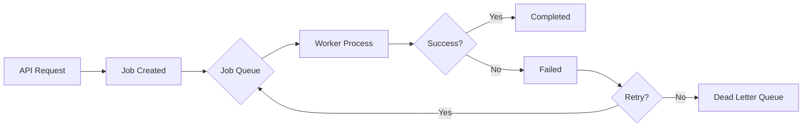

# Admin Tools Guide - Job Queue Monitoring

**Last Updated:** October 25, 2025
**Version:** 2.0.0

---

## Overview

This guide covers the administrative tools for monitoring and managing background jobs, including the job queue UI, retry mechanisms, and troubleshooting.

---

## Table of Contents

1. [Job Queue Overview](#job-queue-overview)
2. [Admin UI](#admin-ui)
3. [Job Statuses](#job-statuses)
4. [Retrying Failed Jobs](#retrying-failed-jobs)
5. [Troubleshooting](#troubleshooting)
6. [Permissions](#permissions)

---

## Job Queue Overview

### What are Background Jobs?

Background jobs handle asynchronous tasks that don't need immediate completion:

**Common Job Types:**
- **Calendar Sync** - Sync events with Google/Outlook
- **Metric Calculation** - Compute dashboard metrics
- **Report Generation** - Generate PDF reports
- **Email Sending** - Send bulk emails
- **Data Import/Export** - Large file processing
- **Inventory Reconciliation** - Daily inventory checks

### Job Queue Architecture



**Components:**
- **Job Queue** - Stores pending jobs (Redis/Database)
- **Worker** - Processes jobs in background
- **Scheduler** - Triggers recurring jobs (cron-like)
- **Dead Letter Queue** - Failed jobs after max retries

---

## Admin UI

### Accessing the Job Monitor

**URL:** `/admin/jobs`

**Requirements:**
- Admin role
- Valid session

**Features:**
- View all jobs (pending, completed, failed)
- Filter by status, type, date range
- Retry failed jobs
- View job details and logs
- Cancel pending jobs
- Clear completed jobs

### Dashboard Overview

```
┌─────────────────────────────────────────────────┐
│ Job Queue Dashboard                              │
├─────────────────────────────────────────────────┤
│ Status Summary                                   │
│  Pending:    15  Running:   3  Failed:   2      │
│  Completed: 142  Dead:      0                    │
├─────────────────────────────────────────────────┤
│ Recent Jobs                                      │
│ ┌────────────┬──────────┬────────┬──────────┐  │
│ │ Type       │ Status   │ Time   │ Actions  │  │
│ ├────────────┼──────────┼────────┼──────────┤  │
│ │ CalSync    │ Running  │ 2s ago │ [Cancel] │  │
│ │ Metrics    │ Pending  │ 5m ago │ [Start]  │  │
│ │ Export     │ Failed   │ 1h ago │ [Retry]  │  │
│ │ Email      │ Complete │ 2h ago │ [View]   │  │
│ └────────────┴──────────┴────────┴──────────┘  │
└─────────────────────────────────────────────────┘
```

### Job List View

**Columns:**
- **ID** - Unique job identifier
- **Type** - Job type (CalendarSync, MetricCalc, etc.)
- **Status** - Current status (see [Job Statuses](#job-statuses))
- **Created** - When job was created
- **Started** - When job began processing
- **Completed** - When job finished
- **Duration** - Time to complete
- **Attempts** - Retry count
- **Actions** - Retry, View, Cancel, Delete

**Filters:**
- Status: All, Pending, Running, Completed, Failed, Dead
- Type: All job types + custom filter
- Date Range: Last hour, Today, Last 7 days, Custom
- User: Filter by who created the job

### Job Details Page

**URL:** `/admin/jobs/[jobId]`

**Information Shown:**
- **Job metadata** (ID, type, status, timestamps)
- **Input data** (parameters passed to job)
- **Output data** (results if completed)
- **Error logs** (stack trace if failed)
- **Retry history** (all attempts)
- **Related jobs** (parent/child jobs)

**Example:**

```yaml
Job ID: job_12345abc
Type: CalendarSync
Status: Failed
Created: 2025-10-25T10:00:00Z
Started: 2025-10-25T10:00:05Z
Failed: 2025-10-25T10:00:30Z
Duration: 25s
Attempts: 3 / 5

Input:
  userId: user_123
  provider: google
  syncType: full

Error:
  message: "Token refresh failed: Invalid refresh token"
  code: "AUTH_ERROR"
  stack: |
    Error: Token refresh failed
      at GoogleCalendarClient.refreshToken (/src/lib/calendar-sync.ts:45)
      at CalendarSyncService.sync (/src/lib/calendar-sync.ts:120)

Retry History:
  1. 2025-10-25T10:00:05Z - Failed (Network timeout)
  2. 2025-10-25T10:01:10Z - Failed (Network timeout)
  3. 2025-10-25T10:03:30Z - Failed (Invalid token)
```

---

## Job Statuses

### Status Lifecycle

```
PENDING → RUNNING → COMPLETED
    ↓         ↓
    ↓     FAILED → RETRYING → PENDING
    ↓         ↓
CANCELLED    DEAD
```

### Status Definitions

| Status | Description | Actions Available |
|--------|-------------|-------------------|
| **PENDING** | Waiting in queue | Start, Cancel, Delete |
| **RUNNING** | Currently executing | Cancel |
| **COMPLETED** | Finished successfully | View, Delete |
| **FAILED** | Error occurred | Retry, View Logs, Delete |
| **RETRYING** | Scheduled for retry | Cancel, View |
| **CANCELLED** | Manually stopped | Delete |
| **DEAD** | Max retries exceeded | Manual Intervention Required |

### Status Colors

- **PENDING** - Blue (⏳)
- **RUNNING** - Yellow (⚡)
- **COMPLETED** - Green (✅)
- **FAILED** - Red (❌)
- **RETRYING** - Orange (🔄)
- **CANCELLED** - Gray (🚫)
- **DEAD** - Dark Red (💀)

---

## Retrying Failed Jobs

### Automatic Retry Logic

**Default Retry Strategy:**
- **Max Attempts:** 5
- **Backoff:** Exponential (1s, 2s, 4s, 8s, 16s)
- **Retry Conditions:** Transient errors (network, timeout)

**Non-Retryable Errors:**
- Invalid parameters
- Authentication failures (expired tokens)
- Resource not found
- Data validation errors

**Example Configuration:**

```typescript
// /src/lib/job-queue.ts
const jobConfig = {
  calendarSync: {
    maxAttempts: 5,
    backoff: 'exponential',
    retryableErrors: ['NETWORK_ERROR', 'TIMEOUT', 'RATE_LIMIT'],
  },
  metricCalculation: {
    maxAttempts: 3,
    backoff: 'linear',
    retryableErrors: ['TIMEOUT'],
  },
};
```

### Manual Retry

**Via Admin UI:**

1. Navigate to `/admin/jobs`
2. Find failed job in list
3. Click **Retry** button
4. Confirm retry dialog
5. Job moves to `PENDING` status

**Via API:**

```typescript
POST /api/admin/jobs/[jobId]/retry

Response:
{
  "success": true,
  "jobId": "job_12345abc",
  "status": "PENDING",
  "scheduledFor": "2025-10-25T10:00:00Z"
}
```

**Via CLI:**

```bash
# Retry specific job
npm run job:retry -- --id job_12345abc

# Retry all failed jobs of a type
npm run job:retry -- --type CalendarSync --status failed

# Retry with delay
npm run job:retry -- --id job_12345abc --delay 60s
```

### Bulk Retry

**Retry all failed jobs from last hour:**

1. Go to `/admin/jobs`
2. Filter: Status = Failed, Date = Last Hour
3. Click **Select All**
4. Click **Bulk Retry**
5. Confirm (shows count)

**SQL Retry (Advanced):**

```sql
-- Move all failed calendar sync jobs back to pending
UPDATE "Job"
SET status = 'PENDING',
    attempts = 0,
    "scheduledFor" = NOW()
WHERE type = 'CalendarSync'
  AND status = 'FAILED'
  AND attempts < 5;
```

---

## Troubleshooting

### Common Issues

#### 1. Calendar Sync Jobs Failing

**Symptoms:**
- Jobs fail with "Token refresh failed"
- Status: `FAILED`
- Error code: `AUTH_ERROR`

**Diagnosis:**

```typescript
// Check user's calendar auth
SELECT * FROM "CalendarAuth"
WHERE "userId" = '[user-id]';

// Check token expiry
SELECT
  "userId",
  provider,
  "tokenExpiry",
  "tokenExpiry" < NOW() as is_expired
FROM "CalendarAuth"
WHERE "userId" = '[user-id]';
```

**Solutions:**

1. **Re-authenticate user:**
   - User navigates to `/settings/calendar`
   - Clicks "Reconnect Google/Outlook"
   - Completes OAuth flow

2. **Manual token refresh:**
   ```typescript
   // API call
   POST /api/calendar/refresh-token
   { "userId": "user_123", "provider": "google" }
   ```

3. **Delete stale auth:**
   ```sql
   DELETE FROM "CalendarAuth"
   WHERE "userId" = '[user-id]'
     AND provider = 'google';
   ```

#### 2. Metric Calculation Timeouts

**Symptoms:**
- Jobs timeout after 30 seconds
- Status: `FAILED`
- Error: "Execution time limit exceeded"

**Diagnosis:**

```typescript
// Check job duration
SELECT
  id,
  type,
  "startedAt",
  "completedAt",
  EXTRACT(EPOCH FROM ("completedAt" - "startedAt")) as duration_seconds
FROM "Job"
WHERE type = 'MetricCalculation'
  AND status = 'FAILED'
ORDER BY "createdAt" DESC
LIMIT 10;
```

**Solutions:**

1. **Optimize metric queries** (add indexes)
2. **Increase timeout:**
   ```typescript
   // /src/lib/job-queue.ts
   const jobConfig = {
     metricCalculation: {
       timeout: 120000, // 120 seconds
     },
   };
   ```
3. **Split into smaller jobs** (per metric type)

#### 3. Dead Letter Queue Buildup

**Symptoms:**
- Many jobs in `DEAD` status
- Job queue slowing down
- Worker process errors

**Diagnosis:**

```sql
-- Count dead jobs by type
SELECT type, COUNT(*) as dead_count
FROM "Job"
WHERE status = 'DEAD'
GROUP BY type
ORDER BY dead_count DESC;

-- Find common error patterns
SELECT
  "errorMessage",
  COUNT(*) as occurrence_count
FROM "Job"
WHERE status = 'DEAD'
GROUP BY "errorMessage"
ORDER BY occurrence_count DESC
LIMIT 5;
```

**Solutions:**

1. **Fix underlying issue** (e.g., update OAuth credentials)
2. **Bulk retry after fix:**
   ```sql
   UPDATE "Job"
   SET status = 'PENDING', attempts = 0
   WHERE status = 'DEAD'
     AND type = 'CalendarSync'
     AND "createdAt" > NOW() - INTERVAL '7 days';
   ```
3. **Archive old dead jobs:**
   ```sql
   DELETE FROM "Job"
   WHERE status = 'DEAD'
     AND "createdAt" < NOW() - INTERVAL '30 days';
   ```

#### 4. Worker Process Not Running

**Symptoms:**
- Jobs stuck in `PENDING`
- No jobs transitioning to `RUNNING`
- Job queue growing

**Diagnosis:**

```bash
# Check if worker is running
ps aux | grep "job-worker"

# Check worker logs
tail -f /var/log/leora/job-worker.log

# Check Redis connection (if using Redis queue)
redis-cli ping
```

**Solutions:**

1. **Start worker process:**
   ```bash
   npm run worker:start
   ```

2. **Restart worker (if hung):**
   ```bash
   npm run worker:restart
   ```

3. **Check environment variables:**
   ```bash
   # Ensure these are set
   DATABASE_URL
   REDIS_URL (if using Redis)
   ```

### Health Checks

**Job Queue Health Endpoint:** `/api/admin/jobs/health`

```json
{
  "status": "healthy",
  "checks": {
    "database": "ok",
    "redis": "ok",
    "worker": "running",
    "pendingJobs": 15,
    "failedJobs": 2,
    "oldestPendingJob": "2 minutes",
    "workerLastPing": "5 seconds ago"
  }
}
```

**Monitoring:**
- **Pending jobs > 100** - Warning (backlog building)
- **Failed jobs > 10** - Warning (systematic issue)
- **Worker last ping > 60s** - Critical (worker down)
- **Oldest pending > 30min** - Warning (slow processing)

---

## Permissions

### Access Control

**Admin UI Access:**
- **Role Required:** `ADMIN` or `MANAGER`
- **Permissions:** `jobs:read`, `jobs:write`, `jobs:delete`

**User-Specific Actions:**
- Users can view their own jobs (e.g., their calendar syncs)
- Admins can view all jobs system-wide

**Permission Check:**

```typescript
// Middleware check
export function requireJobAccess(req: Request, res: Response, next: NextFunction) {
  const user = req.user;
  const jobId = req.params.jobId;

  if (user.role === 'ADMIN') {
    return next(); // Admins can access all jobs
  }

  const job = await getJob(jobId);
  if (job.userId === user.id) {
    return next(); // Users can access their own jobs
  }

  return res.status(403).json({ error: 'Forbidden' });
}
```

### Audit Logging

All admin actions are logged:

```typescript
// Log job retry
await prisma.auditLog.create({
  data: {
    action: 'JOB_RETRY',
    userId: adminUserId,
    resource: 'Job',
    resourceId: jobId,
    metadata: {
      jobType: job.type,
      previousStatus: job.status,
      newStatus: 'PENDING',
    },
  },
});
```

**View audit logs:** `/admin/audit-logs`

---

## Advanced Features

### Job Scheduling

**Recurring Jobs (Cron-like):**

```typescript
// Schedule daily metric calculation at midnight
await scheduleRecurringJob({
  type: 'MetricCalculation',
  schedule: '0 0 * * *', // Cron syntax
  data: { metricType: 'daily_revenue' },
});
```

**Delayed Jobs:**

```typescript
// Process order after 10 minutes
await createJob({
  type: 'ProcessOrder',
  data: { orderId: 'order_123' },
  scheduledFor: new Date(Date.now() + 10 * 60 * 1000),
});
```

### Job Chains

**Sequential Jobs:**

```typescript
// Export report → Email to customer
const exportJob = await createJob({ type: 'ExportReport', data: { reportId } });

await createJob({
  type: 'EmailReport',
  data: { reportId, email: customer.email },
  dependencies: [exportJob.id], // Wait for export to complete
});
```

### Job Priorities

```typescript
// High-priority job (processes first)
await createJob({
  type: 'CriticalSync',
  priority: 'HIGH', // LOW, NORMAL, HIGH, CRITICAL
});
```

---

## Best Practices

1. **Monitor job queue regularly** - Set up alerts
2. **Review failed jobs daily** - Identify patterns
3. **Clean up completed jobs** - Archive after 30 days
4. **Use retries for transient errors only**
5. **Log all job actions** - Audit trail
6. **Set appropriate timeouts** - Prevent hung jobs
7. **Use job priorities** - Critical tasks first
8. **Test retry logic** - Ensure idempotency
9. **Document job types** - What each does
10. **Scale workers horizontally** - For high load

---

## Support

For job queue issues:
- **Slack:** #engineering-support
- **Email:** devops@leoracrm.com
- **Runbook:** `/docs/runbooks/job-queue.md`
