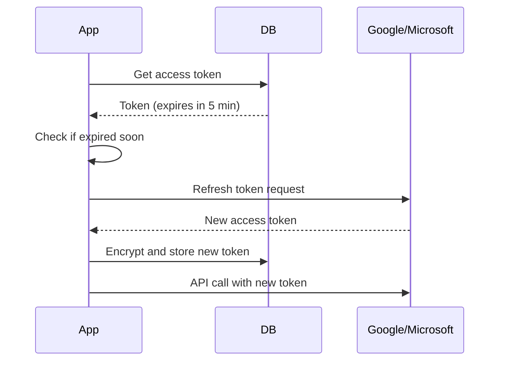

# Calendar Sync Troubleshooting Guide

**Last Updated:** October 25, 2025
**Version:** 2.0.0

---

## Overview

This guide helps diagnose and fix common calendar synchronization issues with Google Calendar and Microsoft Outlook.

---

## Table of Contents

1. [Common Sync Errors](#common-sync-errors)
2. [Token Refresh Issues](#token-refresh-issues)
3. [Rate Limiting](#rate-limiting)
4. [Delta Query Debugging](#delta-query-debugging)
5. [OAuth Setup](#oauth-setup)
6. [Manual Resync](#manual-resync)

---

## Common Sync Errors

### Error: "Token refresh failed: Invalid refresh token"

**Symptom:**
- Calendar sync jobs fail
- User sees "Calendar disconnected" message
- Logs show authentication errors

**Cause:**
- Refresh token expired or revoked
- User changed Google/Microsoft password
- OAuth app credentials changed
- User revoked app access

**Solution:**

1. **Re-authenticate user:**
   ```bash
   # User navigates to:
   /settings/calendar

   # Clicks:
   "Reconnect Google Calendar" or "Reconnect Outlook"
   ```

2. **Check token status:**
   ```typescript
   // API endpoint: GET /api/calendar/status
   {
     "provider": "google",
     "connected": false,
     "tokenExpiry": "2025-10-20T10:00:00Z",
     "lastSync": "2025-10-24T15:30:00Z",
     "error": "Token refresh failed"
   }
   ```

3. **Manual token cleanup:**
   ```sql
   -- Remove stale auth
   DELETE FROM "CalendarAuth"
   WHERE "userId" = '[user-id]'
     AND provider = 'google'
     AND "tokenExpiry" < NOW() - INTERVAL '30 days';
   ```

### Error: "Sync failed: Event not found"

**Symptom:**
- Specific events fail to sync
- Error: "Event ID xyz not found"
- Other events sync successfully

**Cause:**
- Event deleted in external calendar
- Event moved to different calendar
- Calendar permissions changed

**Solution:**

1. **Skip deleted events:**
   ```typescript
   // Calendar sync handles 404 gracefully
   try {
     const event = await fetchEvent(eventId);
   } catch (error) {
     if (error.code === 404) {
       // Mark as deleted in local DB
       await prisma.calendarEvent.update({
         where: { externalId: eventId },
         data: { status: 'DELETED' }
       });
       return; // Skip
     }
     throw error;
   }
   ```

2. **Full resync (if many missing):**
   ```bash
   # Via API
   POST /api/calendar/sync
   {
     "userId": "user_123",
     "provider": "google",
     "fullSync": true
   }
   ```

### Error: "Sync failed: Forbidden"

**Symptom:**
- Cannot read/write to calendar
- Permission denied errors
- Worked previously, stopped working

**Cause:**
- OAuth scopes insufficient
- Calendar sharing permissions changed
- User removed app access

**Solution:**

1. **Check OAuth scopes:**
   ```typescript
   // Required scopes
   GOOGLE_CALENDAR_SCOPES=https://www.googleapis.com/auth/calendar
   OUTLOOK_CALENDAR_SCOPES=Calendars.ReadWrite,offline_access
   ```

2. **Request additional permissions:**
   ```bash
   # User needs to re-authenticate with updated scopes
   /api/calendar/connect/google?prompt=consent
   ```

3. **Verify calendar access:**
   ```typescript
   // Test API call
   const calendars = await googleClient.calendar.calendarList.list();
   console.log('Accessible calendars:', calendars.data.items);
   ```

---

## Token Refresh Issues

### Understanding Token Lifecycle

**Google OAuth Tokens:**
- **Access Token:** Valid for 1 hour
- **Refresh Token:** Valid indefinitely (until revoked)
- **Refresh:** Automatic before expiry

**Microsoft OAuth Tokens:**
- **Access Token:** Valid for 1 hour
- **Refresh Token:** Valid for 90 days (with use)
- **Refresh:** Automatic, but token rotates

### Token Refresh Flow



### Debugging Token Refresh

**Check token status:**

```typescript
// GET /api/calendar/debug/token/[userId]
{
  "provider": "google",
  "accessTokenExpiry": "2025-10-25T11:00:00Z",
  "accessTokenExpired": false,
  "refreshTokenExists": true,
  "refreshTokenEncrypted": true,
  "lastRefresh": "2025-10-25T10:00:00Z",
  "nextRefresh": "2025-10-25T10:55:00Z"
}
```

**Force token refresh:**

```typescript
// POST /api/calendar/refresh-token
{
  "userId": "user_123",
  "provider": "google"
}

// Response:
{
  "success": true,
  "newExpiry": "2025-10-25T12:00:00Z"
}
```

### Common Token Refresh Errors

**1. "Invalid grant" (Google)**

**Cause:** Refresh token expired or revoked

**Solution:**
```typescript
// Detect and handle
if (error.code === 'invalid_grant') {
  // Disconnect calendar
  await prisma.calendarAuth.delete({
    where: { userId_provider: { userId, provider: 'google' } }
  });

  // Notify user to reconnect
  await sendNotification({
    userId,
    type: 'CALENDAR_DISCONNECTED',
    message: 'Please reconnect your Google Calendar'
  });
}
```

**2. "Invalid client" (Microsoft)**

**Cause:** OAuth credentials changed or incorrect

**Solution:**
```bash
# Verify credentials in .env
OUTLOOK_CLIENT_ID=correct_client_id
OUTLOOK_CLIENT_SECRET=correct_secret
OUTLOOK_TENANT_ID=common  # or specific tenant
```

**3. Rate limiting during refresh**

**Cause:** Too many refresh requests

**Solution:**
```typescript
// Implement refresh throttling
const lastRefresh = await redis.get(`refresh:${userId}:${provider}`);
if (lastRefresh && Date.now() - lastRefresh < 5000) {
  throw new Error('Please wait before refreshing again');
}

await redis.set(`refresh:${userId}:${provider}`, Date.now());
```

---

## Rate Limiting

### Google Calendar Limits

**Quotas:**
- **10,000 requests/day** (per project)
- **10 queries/second** (per user)

**Best Practices:**
- Use delta queries (incremental sync)
- Batch operations where possible
- Cache frequently accessed data
- Implement exponential backoff

### Microsoft Graph Limits

**Throttling:**
- **120 requests/minute** (per user)
- **10,000 requests/10 minutes** (per app)

**Handling Rate Limits:**

```typescript
// Detect rate limit error
if (error.code === 429) {
  const retryAfter = error.headers['retry-after'];
  const delayMs = (retryAfter || 60) * 1000;

  // Schedule retry
  await scheduleJob({
    type: 'CalendarSync',
    userId,
    scheduledFor: new Date(Date.now() + delayMs)
  });
}
```

**Exponential Backoff:**

```typescript
async function syncWithBackoff(userId: string, maxRetries = 5) {
  for (let i = 0; i < maxRetries; i++) {
    try {
      return await syncCalendar(userId);
    } catch (error) {
      if (error.code === 429 && i < maxRetries - 1) {
        const delay = Math.pow(2, i) * 1000; // 1s, 2s, 4s, 8s, 16s
        await sleep(delay);
        continue;
      }
      throw error;
    }
  }
}
```

### Monitoring Rate Limits

**Check quota usage:**

```typescript
// GET /api/calendar/quota
{
  "provider": "google",
  "quotaUsed": 1250,
  "quotaLimit": 10000,
  "percentUsed": 12.5,
  "resetTime": "2025-10-26T00:00:00Z"
}
```

**Alerts:**
- Quota > 80% used - Warning
- Rate limit hit - Critical
- Failed requests > 10 - Warning

---

## Delta Query Debugging

### What are Delta Queries?

**Definition:** Fetch only changes since last sync (not full calendar)

**Benefits:**
- Faster syncs (less data)
- Lower API usage (quota-friendly)
- Reduced server load

### Google Calendar Delta Sync

**How It Works:**

```typescript
// Initial sync (full)
const response = await calendar.events.list({
  calendarId: 'primary',
  maxResults: 250,
});

// Save sync token
const syncToken = response.data.nextSyncToken;
await saveSyncToken(userId, 'google', syncToken);

// Subsequent sync (delta)
const deltaResponse = await calendar.events.list({
  calendarId: 'primary',
  syncToken: syncToken, // Only changes since last sync
});
```

**Delta Query Errors:**

**1. "Sync token is no longer valid"**

**Cause:** Token expired (too much time passed)

**Solution:**
```typescript
try {
  const events = await calendar.events.list({ syncToken });
} catch (error) {
  if (error.code === 410) { // Gone
    // Fall back to full sync
    const events = await calendar.events.list({ calendarId: 'primary' });
    await saveSyncToken(userId, 'google', events.data.nextSyncToken);
  }
}
```

**2. "Invalid sync token format"**

**Cause:** Token corrupted or encrypted incorrectly

**Solution:**
```typescript
// Validate sync token before use
function isValidSyncToken(token: string): boolean {
  return token && token.length > 0 && !token.includes(' ');
}

if (!isValidSyncToken(syncToken)) {
  // Discard and do full sync
  await fullSync(userId);
}
```

### Microsoft Graph Delta Query

**How It Works:**

```typescript
// Initial sync
const response = await graphClient
  .api('/me/calendar/events/delta')
  .get();

// Save delta link
const deltaLink = response['@odata.deltaLink'];
await saveDeltaLink(userId, 'outlook', deltaLink);

// Subsequent sync
const deltaResponse = await graphClient
  .api(deltaLink)
  .get();
```

**Delta Link Expiration:**

**Cause:** Delta links expire after 30 days

**Solution:**
```typescript
// Track delta link age
const deltaLinkAge = Date.now() - deltaLinkCreatedAt;
const maxAge = 30 * 24 * 60 * 60 * 1000; // 30 days

if (deltaLinkAge > maxAge) {
  // Do full sync and get new delta link
  await fullSync(userId);
}
```

---

## OAuth Setup

### Google Calendar OAuth Setup

**Step 1: Create OAuth Client**

1. Go to [Google Cloud Console](https://console.cloud.google.com)
2. Select/create project
3. Enable Google Calendar API
4. Create OAuth 2.0 Client ID (Web application)

**Step 2: Configure Redirect URIs**

```
http://localhost:3000/api/calendar/connect/google/callback
https://yourdomain.com/api/calendar/connect/google/callback
```

**Step 3: Set Environment Variables**

```bash
# .env.local
GOOGLE_CLIENT_ID=your_client_id.apps.googleusercontent.com
GOOGLE_CLIENT_SECRET=your_client_secret
GOOGLE_REDIRECT_URI=http://localhost:3000/api/calendar/connect/google/callback

# Scopes (separate with comma)
GOOGLE_CALENDAR_SCOPES=https://www.googleapis.com/auth/calendar
```

**Step 4: Test OAuth Flow**

```bash
# Navigate to:
http://localhost:3000/api/calendar/connect/google

# Should redirect to Google consent screen
# After approval, redirects back with code
# Code exchanges for tokens
```

### Microsoft Outlook OAuth Setup

**Step 1: Register App in Azure**

1. Go to [Azure Portal](https://portal.azure.com)
2. Azure Active Directory → App Registrations
3. New Registration
4. Set redirect URI (Web): `https://yourdomain.com/api/calendar/connect/outlook/callback`

**Step 2: Create Client Secret**

1. Certificates & secrets → New client secret
2. Copy secret (shown once!)

**Step 3: Configure API Permissions**

1. API permissions → Add permission
2. Microsoft Graph → Delegated permissions
3. Add: `Calendars.ReadWrite`, `offline_access`
4. Grant admin consent (if organizational)

**Step 4: Set Environment Variables**

```bash
# .env.local
OUTLOOK_CLIENT_ID=your_application_id
OUTLOOK_CLIENT_SECRET=your_client_secret
OUTLOOK_TENANT_ID=common  # or specific tenant ID
OUTLOOK_REDIRECT_URI=http://localhost:3000/api/calendar/connect/outlook/callback

# Scopes
OUTLOOK_CALENDAR_SCOPES=Calendars.ReadWrite,offline_access
```

### Testing OAuth Integration

**Health Check:**

```typescript
// GET /api/calendar/health
{
  "google": {
    "configured": true,
    "clientIdSet": true,
    "clientSecretSet": true,
    "redirectUriValid": true
  },
  "outlook": {
    "configured": true,
    "clientIdSet": true,
    "clientSecretSet": true,
    "tenantIdSet": true,
    "redirectUriValid": true
  }
}
```

**Test Connection:**

```bash
# Google
curl http://localhost:3000/api/calendar/connect/google

# Outlook
curl http://localhost:3000/api/calendar/connect/outlook
```

---

## Manual Resync

### When to Resync

**Scenarios:**
- Calendar stopped syncing
- Events missing or duplicated
- After resolving auth issues
- After OAuth scope changes
- Data corruption suspected

### Triggering Manual Resync

**Via UI:**

1. Navigate to `/settings/calendar`
2. Select provider (Google/Outlook)
3. Click "Resync Calendar"
4. Wait for completion notification

**Via API:**

```typescript
POST /api/calendar/sync
{
  "userId": "user_123",
  "provider": "google",
  "fullSync": true  // Ignore delta, fetch all events
}

// Response:
{
  "success": true,
  "syncId": "sync_abc123",
  "status": "RUNNING",
  "estimatedDuration": "30 seconds"
}

// Check sync status:
GET /api/calendar/sync/sync_abc123
{
  "status": "COMPLETED",
  "eventsProcessed": 142,
  "eventsCreated": 5,
  "eventsUpdated": 12,
  "eventsDeleted": 3,
  "duration": "28 seconds"
}
```

**Via CLI (Admin):**

```bash
# Resync specific user
npm run calendar:resync -- --userId user_123 --provider google

# Resync all users (Google)
npm run calendar:resync -- --provider google --all

# Resync with date range
npm run calendar:resync -- --userId user_123 --from 2025-10-01 --to 2025-10-31
```

### Resync Safety

**Conflict Resolution:**
- Local changes win (by default)
- Can configure "remote wins" mode
- Timestamp-based tiebreaker

**Duplicate Prevention:**
- Events matched by external ID
- Hash-based duplicate detection
- Merge duplicates automatically

### Post-Resync Validation

**Check sync result:**

```sql
-- Count events synced
SELECT provider, COUNT(*) as event_count
FROM "CalendarEvent"
WHERE "userId" = '[user-id]'
GROUP BY provider;

-- Check for duplicates
SELECT "externalId", COUNT(*) as duplicate_count
FROM "CalendarEvent"
WHERE "userId" = '[user-id]'
GROUP BY "externalId"
HAVING COUNT(*) > 1;

-- Verify sync token updated
SELECT
  provider,
  "syncToken",
  "lastSyncedAt",
  NOW() - "lastSyncedAt" as time_since_sync
FROM "CalendarAuth"
WHERE "userId" = '[user-id]';
```

---

## Debugging Tools

### Enable Debug Logging

```bash
# .env.local
DEBUG=calendar:*
LOG_LEVEL=debug
```

**Log output:**

```
calendar:sync [user_123] Starting Google Calendar sync
calendar:token [user_123] Access token expires in 45 minutes
calendar:sync [user_123] Using delta sync (token: abc123...)
calendar:api [user_123] Fetching events delta
calendar:api [user_123] Received 15 changed events
calendar:sync [user_123] Processing event: "Team Meeting" (created)
calendar:sync [user_123] Processing event: "Lunch" (updated)
calendar:db [user_123] Saved 2 events to database
calendar:sync [user_123] Sync complete: 2 created, 1 updated, 0 deleted
```

### Sync Monitoring Dashboard

**URL:** `/admin/calendar-sync`

**Metrics Shown:**
- Active syncs (real-time)
- Sync success rate (24h)
- Average sync duration
- Failed syncs (last 100)
- Token expiry warnings

### Common Debug Queries

```sql
-- Find users with sync errors
SELECT
  u.email,
  ca.provider,
  ca."lastSyncError",
  ca."lastSyncedAt"
FROM "CalendarAuth" ca
JOIN "User" u ON ca."userId" = u.id
WHERE ca."lastSyncError" IS NOT NULL;

-- Find stale syncs (> 24h)
SELECT
  u.email,
  ca.provider,
  NOW() - ca."lastSyncedAt" as hours_since_sync
FROM "CalendarAuth" ca
JOIN "User" u ON ca."userId" = u.id
WHERE ca."lastSyncedAt" < NOW() - INTERVAL '24 hours';

-- Count events by provider
SELECT
  ca.provider,
  COUNT(ce.id) as event_count
FROM "CalendarAuth" ca
LEFT JOIN "CalendarEvent" ce ON ca."userId" = ce."userId" AND ca.provider = ce.provider
GROUP BY ca.provider;
```

---

## Support

For calendar sync issues:
- **Slack:** #calendar-support
- **Email:** support@leoracrm.com
- **Documentation:** `/docs/calendar-sync-setup.md`
