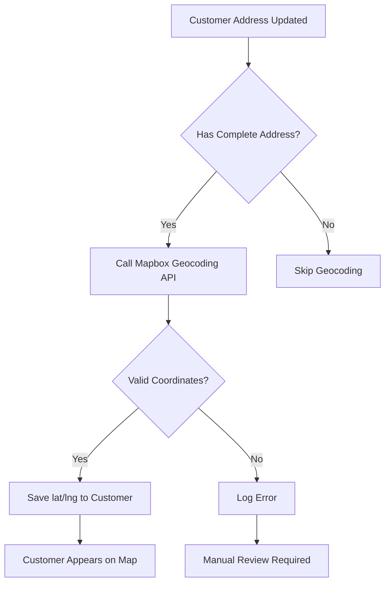

# Geocoding Technical Guide

## Overview

Comprehensive guide to address geocoding in Leora CRM using Mapbox Geocoding API. Covers batch processing, rate limits, caching, troubleshooting, and best practices.

---

## Table of Contents

1. [How Geocoding Works](#how-geocoding-works)
2. [Batch Geocoding Process](#batch-geocoding-process)
3. [Rate Limits & Quotas](#rate-limits--quotas)
4. [Caching Strategy](#caching-strategy)
5. [Troubleshooting Failures](#troubleshooting-failures)
6. [Manual Coordinate Entry](#manual-coordinate-entry)
7. [Geocoding Accuracy](#geocoding-accuracy)
8. [API Reference](#api-reference)

---

## How Geocoding Works

### What is Geocoding?

**Geocoding** = Converting a street address into geographic coordinates (latitude/longitude).

**Example:**
```
Input:  "1600 Pennsylvania Avenue NW, Washington, DC 20500"
Output: { latitude: 38.8977, longitude: -77.0365 }
```

### When Geocoding Happens

**Automatic Geocoding:**
1. Customer created with complete address
2. Customer address updated
3. Batch import from CSV

**Manual Geocoding:**
1. Click "Geocode Address" button on customer page
2. Bulk geocode from customer list
3. Admin geocoding tools

### Geocoding Flow



### Required Address Fields

For best geocoding results, provide:
- ✅ **Street Address** (required)
- ✅ **City** (required)
- ✅ **State** (required)
- ✅ **Postal Code** (highly recommended)
- ⭕ Country (defaults to USA)

**Example:**
```json
{
  "addressLine1": "350 Fifth Avenue",
  "addressLine2": "Floor 30",
  "city": "New York",
  "state": "NY",
  "postalCode": "10118",
  "country": "USA"
}
```

---

## Batch Geocoding Process

### When to Use Batch Geocoding

- Importing customers from CSV (100+ customers)
- Onboarding new customer database
- Fixing missing coordinates for existing customers
- Re-geocoding after address updates

### Running Batch Geocoding

#### Via UI (Customer List Page)

1. Navigate to **Customers** page
2. Click **"Geocode Missing"** button
3. Select customers (or "All with addresses")
4. Click **"Start Geocoding"**
5. Monitor progress bar
6. Review results report

#### Via API

```typescript
POST /api/geocode/batch

Request:
{
  "customerIds": ["cust_123", "cust_456", ...],
  // OR
  "filter": { "latitude": null, "addressLine1": { "not": null } }
}

Response:
{
  "total": 150,
  "geocoded": 145,
  "failed": 5,
  "skipped": 0,
  "duration": 16800, // milliseconds
  "results": [
    {
      "customerId": "cust_123",
      "status": "success",
      "coordinates": { "lat": 37.7749, "lng": -122.4194 }
    },
    {
      "customerId": "cust_789",
      "status": "failed",
      "error": "Address not found"
    }
  ]
}
```

### Batch Performance

| Customers | Estimated Time | Notes |
|-----------|----------------|-------|
| 10 | ~2 seconds | Near instant |
| 100 | ~17 seconds | Rate limited |
| 500 | ~1.5 minutes | Batched processing |
| 1,000 | ~3 minutes | Queue system |
| 5,000 | ~15 minutes | Background job |

**Rate Limit:** 600 requests/minute (Mapbox free tier)

### Progress Tracking

Real-time progress updates:

```typescript
// WebSocket or polling endpoint
GET /api/geocode/batch/:jobId/progress

Response:
{
  "jobId": "job_abc123",
  "status": "running",
  "progress": {
    "total": 1000,
    "completed": 345,
    "succeeded": 340,
    "failed": 5,
    "percentage": 34.5
  },
  "estimatedTimeRemaining": 120000 // ms
}
```

---

## Rate Limits & Quotas

### Mapbox Free Tier Limits

| Metric | Limit | Our Usage |
|--------|-------|-----------|
| **Requests/Month** | 100,000 | ~12,000 (12%) |
| **Requests/Minute** | 600 | Enforced |
| **Requests/Second** | 10 | Enforced |
| **Batch Size** | No limit | 100 recommended |

### Rate Limit Handling

**Automatic Queueing:**
- Requests queued when limit approached
- Spaced at 100ms intervals (600/min)
- Progress callback for UI updates

**Implementation:**
```typescript
class GeocodingQueue {
  private queue: GeocodingRequest[] = [];
  private processing = false;
  private readonly RATE_LIMIT_MS = 100; // 600/min

  async add(request: GeocodingRequest) {
    this.queue.push(request);
    if (!this.processing) {
      await this.processQueue();
    }
  }

  private async processQueue() {
    this.processing = true;
    while (this.queue.length > 0) {
      const request = this.queue.shift();
      await this.geocode(request);
      await this.delay(this.RATE_LIMIT_MS);
    }
    this.processing = false;
  }
}
```

### Monitoring Usage

**Check Current Usage:**
```bash
GET /api/geocode/usage

Response:
{
  "month": "2024-12",
  "requestsUsed": 12,450,
  "requestsLimit": 100,000,
  "percentageUsed": 12.45,
  "estimatedMonthlyUsage": 14,500,
  "withinLimit": true
}
```

**Usage Alerts:**
- 75% of monthly limit: Email warning
- 90% of monthly limit: Dashboard alert
- 95% of monthly limit: Geocoding paused

### Exceeding Limits

**If Monthly Limit Exceeded:**
1. Geocoding automatically pauses
2. Admin receives notification
3. Options:
   - Upgrade to paid tier ($5/mo for 100k extra)
   - Wait for next month
   - Prioritize critical geocoding

**Paid Tier Pricing:**
- First 100,000: Included in free tier
- Next 100,000: $5
- 100,001 - 1,000,000: $4/1000
- 1,000,001+: $3/1000

---

## Caching Strategy

### Why Caching Matters

- **Reduce API calls** - Save on quota
- **Improve performance** - Instant results for common addresses
- **Cost savings** - Fewer paid API requests

### Cache Implementation

**Cache Duration:** 30 days

**Cache Key:** Normalized address
```typescript
function getCacheKey(address: AddressInput): string {
  return [
    address.addressLine1,
    address.city,
    address.state,
    address.postalCode,
  ]
    .map((s) => s.toLowerCase().trim())
    .join('|');
}
```

**Cache Storage:** Redis

```typescript
// Check cache before API call
async function geocodeAddress(address: AddressInput) {
  const cacheKey = getCacheKey(address);

  // Check cache
  const cached = await redis.get(`geocode:${cacheKey}`);
  if (cached) {
    return JSON.parse(cached);
  }

  // Call Mapbox API
  const result = await mapboxGeocode(address);

  // Save to cache (30 day TTL)
  await redis.setex(
    `geocode:${cacheKey}`,
    30 * 24 * 60 * 60,
    JSON.stringify(result)
  );

  return result;
}
```

### Cache Hit Rate

**Target:** 80%+ cache hit rate

**Monitor:**
```bash
GET /api/geocode/cache/stats

Response:
{
  "totalRequests": 1000,
  "cacheHits": 850,
  "cacheMisses": 150,
  "hitRate": 0.85,
  "cacheSize": 4523,
  "oldestEntry": "2024-11-15T10:30:00Z"
}
```

### Cache Invalidation

**Automatic Invalidation:**
- After 30 days (TTL)
- When address changes

**Manual Invalidation:**
```typescript
// Clear specific address
DELETE /api/geocode/cache/:customerId

// Clear all cache (admin only)
DELETE /api/geocode/cache/all
```

---

## Troubleshooting Failures

### Common Failure Reasons

#### 1. Incomplete Address
**Error:** "Insufficient address information"

**Solution:**
- Ensure street address, city, and state are provided
- Add postal code if missing
- Verify address fields are populated

#### 2. Invalid Address
**Error:** "Address not found"

**Causes:**
- Typo in street name
- Non-existent address
- New construction not yet in database

**Solution:**
- Verify address with customer
- Use Google Maps to find correct address
- Manually enter coordinates

#### 3. Ambiguous Address
**Error:** "Multiple matches found"

**Example:** "Main Street" (exists in thousands of cities)

**Solution:**
- Add city and state
- Include postal code
- Be more specific ("123 Main Street")

#### 4. International Address
**Error:** "Country not supported"

**Note:** Mapbox supports 200+ countries, but quality varies

**Solution:**
- Verify country code
- Format address per local standards
- Consider manual coordinate entry

#### 5. PO Box / Non-Physical Address
**Error:** "Cannot geocode PO Box"

**Solution:**
- Request physical address from customer
- Use business location if available
- Mark as "No physical location"

### Geocoding Error Codes

| Code | Error | Action |
|------|-------|--------|
| `INSUFFICIENT_INFO` | Incomplete address | Add missing fields |
| `NOT_FOUND` | Address not found | Verify address |
| `AMBIGUOUS` | Multiple matches | Add details |
| `INVALID_FORMAT` | Malformed address | Reformat |
| `RATE_LIMIT` | API limit exceeded | Retry later |
| `API_ERROR` | Mapbox API error | Check status |

### Debugging Failed Geocoding

**View Geocoding Logs:**
```bash
GET /api/geocode/logs?customerId=cust_123

Response:
[
  {
    "timestamp": "2024-12-15T10:30:45Z",
    "customerId": "cust_123",
    "address": "123 Main St, Springfield, IL",
    "status": "failed",
    "error": "AMBIGUOUS",
    "errorMessage": "Multiple Main Streets in Springfield",
    "suggestions": [
      "Add postal code",
      "Specify street direction (N/S/E/W)"
    ]
  }
]
```

### Retry Strategies

**Automatic Retry:**
- Network errors: 3 retries with exponential backoff
- Rate limits: Queue for later
- API errors: No retry (requires fix)

**Manual Retry:**
1. Fix address issues
2. Click "Retry Geocoding"
3. Monitor result

---

## Manual Coordinate Entry

### When to Enter Manually

- Geocoding repeatedly fails
- New construction/development
- Rural areas with poor address data
- International addresses
- Customer requires specific pin placement

### How to Enter Coordinates

#### Via UI

1. Open customer record
2. Click "Edit" next to address
3. Scroll to "Geographic Coordinates"
4. Enter latitude and longitude
5. Click "Verify on Map" to confirm
6. Save

#### Via API

```typescript
PATCH /api/customers/:id

Request:
{
  "latitude": 37.7749,
  "longitude": -122.4194,
  "coordinateSource": "manual" // Track source
}
```

### Finding Coordinates

**Method 1: Google Maps**
1. Find location on maps.google.com
2. Right-click location
3. Click coordinates to copy
4. Format: `37.7749, -122.4194`

**Method 2: Apple Maps** (macOS/iOS)
1. Find location
2. Click "Share"
3. Copy coordinates from URL

**Method 3: GPS Device**
1. Visit customer location
2. Record GPS coordinates
3. Enter in CRM

### Coordinate Validation

**Valid Ranges:**
- **Latitude:** -90 to 90
- **Longitude:** -180 to 180

**Common Mistakes:**
- ❌ Swapping lat/lng: `(-122.4194, 37.7749)` - Wrong!
- ✅ Correct order: `(37.7749, -122.4194)` - Right!

**Precision:**
- 4 decimal places: ~11 meters (building level)
- 5 decimal places: ~1 meter (door level)
- 6 decimal places: ~0.1 meter (overkill)

**Recommendation:** Use 5 decimal places

---

## Geocoding Accuracy

### Accuracy Levels

| Level | Description | Use Case |
|-------|-------------|----------|
| **Rooftop** | Exact building | Best for routing |
| **Interpolated** | Estimated on street | Good for most uses |
| **Geometric Center** | Center of area (zip) | Territory planning |
| **Approximate** | General area | Low confidence |

### Mapbox Accuracy Indicators

```json
{
  "place_name": "350 5th Ave, New York, NY 10118",
  "coordinates": [-73.9856, 40.7488],
  "accuracy": "rooftop", // or "interpolated", "point"
  "confidence": 0.98 // 0-1 scale
}
```

### Improving Accuracy

**Best Practices:**
1. **Include Postal Code** - Narrows search significantly
2. **Use Full Street Name** - "Street" vs "St" matters
3. **Add Directionals** - "123 N Main" vs "123 Main"
4. **Spell Out** - "Suite 100" vs "Ste 100"
5. **Verify Results** - Check map placement

### Quality Assurance

**Automated Checks:**
- Coordinates within expected country bounds
- Not in ocean/invalid areas
- Matches postal code region

**Manual Review Queue:**
- Low confidence results (<0.7)
- Unusual distance from postal code center
- Customer flagged as "Important"

---

## API Reference

### Geocode Single Address

```typescript
POST /api/geocode

Request:
{
  "address": "123 Main St, San Francisco, CA 94102"
  // OR structured
  "addressLine1": "123 Main St",
  "city": "San Francisco",
  "state": "CA",
  "postalCode": "94102"
}

Response:
{
  "success": true,
  "result": {
    "latitude": 37.7749,
    "longitude": -122.4194,
    "formattedAddress": "123 Main St, San Francisco, CA 94102",
    "accuracy": "rooftop",
    "confidence": 0.98,
    "source": "mapbox"
  }
}
```

### Geocode Customer

```typescript
POST /api/customers/:id/geocode

Response:
{
  "success": true,
  "customer": {
    "id": "cust_123",
    "latitude": 37.7749,
    "longitude": -122.4194,
    "geocodedAt": "2024-12-15T10:30:45Z"
  }
}
```

### Batch Geocode

```typescript
POST /api/geocode/batch

Request:
{
  "customerIds": ["cust_123", "cust_456"],
  "options": {
    "skipExisting": true, // Don't re-geocode
    "maxConcurrent": 10
  }
}

Response:
{
  "jobId": "job_abc123",
  "status": "queued",
  "estimatedDuration": 17000
}
```

### Check Batch Status

```typescript
GET /api/geocode/batch/:jobId

Response:
{
  "jobId": "job_abc123",
  "status": "completed",
  "summary": {
    "total": 100,
    "succeeded": 95,
    "failed": 5,
    "skipped": 0
  },
  "results": [ /* detailed results */ ]
}
```

---

## Best Practices

### Address Data Entry

✅ **Do:**
- Use standardized abbreviations (St, Ave, Blvd)
- Include postal codes always
- Validate addresses at entry
- Provide address autocomplete

❌ **Don't:**
- Mix address formats
- Use PO Boxes for mapping
- Skip required fields
- Ignore validation warnings

### Performance Optimization

1. **Batch when possible** - More efficient than individual
2. **Use cache** - Check before calling API
3. **Schedule bulk operations** - Run during off-peak
4. **Monitor quotas** - Avoid hitting limits

### Data Quality

**Regular Maintenance:**
- Monthly: Review failed geocoding
- Quarterly: Re-geocode low-confidence results
- Annually: Update addresses from customer data

**Metrics to Track:**
- Geocoding success rate (target: >95%)
- Average geocoding time
- Cache hit rate
- API quota usage

---

## Troubleshooting Checklist

- [ ] Address has street, city, state
- [ ] Postal code included
- [ ] No typos in address
- [ ] Address actually exists (check Google Maps)
- [ ] Not a PO Box
- [ ] Within API rate limits
- [ ] Cache checked first
- [ ] Error logs reviewed
- [ ] Customer address verified

---

## Support & Resources

**Get Help:**
- 📧 Technical Support: dev@example.com
- 📖 Mapbox Docs: https://docs.mapbox.com/api/search/geocoding
- 🐛 Report Issues: GitHub Issues

**Related Guides:**
- [Maps Guide](./MAPS_GUIDE.md)
- [Territory Planning Guide](./TERRITORY_PLANNING_GUIDE.md)
- [API Reference](./API_REFERENCE.md)

---

**Last Updated:** 2024-12-15
**Version:** 5.0.0 (Phase 6)
