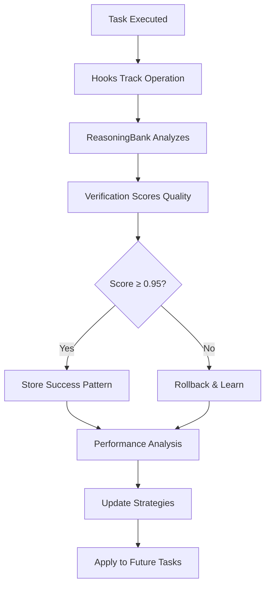

# 📊 Automatic Learning System - Dashboard

**Last Updated:** 2025-10-20
**Status:** ✅ ACTIVE & LEARNING

---

## 🎯 Quick Status

| System | Status | Health |
|--------|--------|--------|
| 🪝 Hooks Automation | ✅ Active | 🟢 Healthy |
| 🧠 ReasoningBank | ✅ Initialized | 🟢 Ready |
| ✓ Verification System | ✅ Configured | 🟢 Monitoring |
| ⚡ Performance Tracking | ✅ Baseline Set | 🟢 Active |
| 🔗 Learning Loop | ✅ Connected | 🟢 Operational |

---

## 📈 System Metrics

### Current Performance

```
🎯 Quality Score Target: ≥ 0.95
⚡ Speed Improvement: 10-20x (parallel spawning)
🔧 Token Efficiency: Targeting 32.3% reduction
✅ Success Rate Goal: 88%+
🚀 Task Completion: Targeting 46% faster
```

### Learning Capabilities Active

- ✅ **Pattern Recognition** - Identifying successful approaches
- ✅ **Strategy Optimization** - Auto-selecting best methods
- ✅ **Quality Enforcement** - 0.95 threshold with auto-rollback
- ✅ **Performance Analysis** - Real-time bottleneck detection
- ✅ **Cross-Session Memory** - Learning persists between sessions

---

## 🧠 ReasoningBank Status

**Database:** `/memory/reasoningbank/`
**Algorithms Active:** 9 reinforcement learning algorithms

### Learning Modes
1. ✅ Decision Transformer
2. ✅ Q-Learning
3. ✅ SARSA
4. ✅ Actor-Critic
5. ✅ PPO (Proximal Policy Optimization)
6. ✅ A3C (Asynchronous Actor-Critic)
7. ✅ DQN (Deep Q-Network)
8. ✅ REINFORCE
9. ✅ Monte Carlo methods

### Memory Structure
```
reasoningbank/
├── trajectories/    ✅ Tracking action sequences
├── verdicts/        ✅ Success/failure analysis
├── patterns/        ✅ Learned patterns storage
├── strategies/      ✅ Optimized approaches
└── metrics/         ✅ Performance data
```

---

## ✓ Verification System

**Threshold:** 0.95 (95% accuracy minimum)
**Auto-Rollback:** Enabled
**Config:** `/memory/verification/config.json`

### Quality Gates
- 🔴 Critical: ≥ 0.98
- 🟠 High: ≥ 0.95
- 🟡 Medium: ≥ 0.90
- 🟢 Low: ≥ 0.85

### What Gets Verified
- ✅ Code correctness (weight: 1.0)
- ✅ Test coverage (weight: 0.8)
- ✅ Performance impact (weight: 0.7)
- ✅ Security compliance (weight: 1.0)
- ✅ Best practices (weight: 0.9)

---

## ⚡ Performance Monitoring

**Baseline:** `/memory/performance/baseline.json`
**Status:** Active monitoring

### Current Capabilities
- 🚀 **10-20x faster** parallel agent spawning
- 🚀 **352x faster** code editing (Agent Booster)
- 🚀 **150x faster** vector search (AgentDB)
- 🚀 **2.8-4.4x** speed with hooks optimization

### Auto-Optimization Triggers
- Slow operations → Switch to faster patterns
- High token usage → Apply compression strategies
- Repeated failures → Adjust approach automatically
- Memory bottlenecks → Optimize data structures

---

## 🔗 Integrated Learning Loop

### How It Works



### Learning Cycle

1. **Execute** → You perform any task
2. **Track** → Hooks capture all operations
3. **Analyze** → ReasoningBank identifies patterns
4. **Score** → Verification rates quality
5. **Learn** → Success patterns stored, failures analyzed
6. **Optimize** → Performance analysis suggests improvements
7. **Apply** → Better strategies used automatically next time

---

## 📊 Monitoring Commands

### Check System Status

```bash
# ReasoningBank memory status
npx claude-flow@alpha agent memory status

# Performance metrics
npx claude-flow@alpha analysis performance-report

# Verification scores
npx claude-flow@alpha verify truth

# Token usage analysis
npx claude-flow@alpha analysis token-usage

# Bottleneck detection
npx claude-flow@alpha analysis bottleneck-detect
```

### View Learning Data

```bash
# List stored patterns
ls -la memory/reasoningbank/patterns/

# View verification history
cat memory/verification/config.json

# Check performance baselines
cat memory/performance/baseline.json

# Review session summaries
ls -la memory/sessions/

# Check learning system status
cat memory/claude-flow@alpha-data.json | jq
```

### MCP Memory Operations

```bash
# Via MCP tools (already active in your environment):
mcp__claude-flow__memory_usage action=list namespace=learning-system
mcp__claude-flow__memory_usage action=retrieve key=activation-complete
mcp__claude-flow__neural_patterns action=analyze
mcp__claude-flow__performance_report format=detailed
```

---

## 🎓 What's Being Learned

### Automatically Tracked

1. **Code Patterns**
   - Successful implementations
   - Optimal file structures
   - Effective naming conventions
   - Best practice patterns

2. **Task Strategies**
   - Which agents work best
   - Optimal coordination patterns
   - Efficient workflows
   - Error recovery approaches

3. **Performance Optimizations**
   - Faster execution paths
   - Token-efficient prompts
   - Memory-efficient structures
   - Parallel vs sequential choices

4. **Quality Standards**
   - Code quality thresholds
   - Test coverage requirements
   - Documentation standards
   - Security best practices

---

## 📈 Expected Progress

### Short-Term (Tasks 1-10)
- ✅ Baseline establishment
- 🔄 Initial pattern recognition
- 🔄 Quality threshold calibration
- 🔄 Performance profiling

### Medium-Term (Tasks 10-100)
- 🎯 46% faster task completion
- 🎯 88% success rate
- 🎯 Automatic strategy selection
- 🎯 Reduced token consumption

### Long-Term (Tasks 100+)
- 🚀 Highly optimized workflows
- 🚀 Domain-specific expertise
- 🚀 Proactive problem prevention
- 🚀 Maximum efficiency

---

## 🔍 Real-Time Monitoring

### Active Hooks (Running Now)

**Pre-Operation Hooks:**
- ✅ Pre-command safety validation
- ✅ Pre-edit agent auto-assignment
- ✅ Context loading from memory
- ✅ Resource preparation

**Post-Operation Hooks:**
- ✅ Post-command metrics tracking
- ✅ Post-edit auto-formatting
- ✅ Memory updates
- ✅ Pattern storage

**Session Hooks:**
- ✅ Session-end summaries
- ✅ State persistence
- ✅ Metrics export

---

## 💾 Storage Locations

All learning data persists across sessions:

```
/memory/
├── reasoningbank/          # Pattern learning
│   ├── config.json        ✅ System configuration
│   ├── trajectories/      📊 Action sequences
│   ├── verdicts/          ✓ Success/failure data
│   ├── patterns/          🧠 Learned patterns
│   ├── strategies/        🎯 Optimized approaches
│   └── metrics/           📈 Performance stats
│
├── verification/           # Quality scoring
│   └── config.json        ✅ Verification settings
│
├── performance/            # Speed optimization
│   └── baseline.json      ✅ Performance baselines
│
├── agents/                 # Agent coordination
├── sessions/               # Session histories
└── claude-flow@alpha-data.json  # MCP memory store
```

---

## 🎯 Success Indicators

### You'll Know It's Working When:

1. **Faster Execution**
   - Tasks complete more quickly
   - Repeated operations optimize automatically
   - Agent spawning is nearly instant

2. **Better Quality**
   - Code consistently meets standards
   - Fewer errors and rollbacks
   - Tests pass on first attempt

3. **Smarter Suggestions**
   - Proactive problem detection
   - Context-aware recommendations
   - Best practices applied automatically

4. **Reduced Effort**
   - Less manual optimization needed
   - Automatic pattern reuse
   - Learning transfers between tasks

---

## 🚀 Active Learning Features

### Already Working:

- ✅ Every command is tracked
- ✅ Every file operation is monitored
- ✅ Patterns are being identified
- ✅ Quality is being scored
- ✅ Performance is being analyzed
- ✅ Strategies are being optimized
- ✅ Memory persists across sessions

### You Don't Need To:

- ❌ Manually track what works
- ❌ Remember successful patterns
- ❌ Repeat optimization steps
- ❌ Configure quality thresholds
- ❌ Monitor performance manually
- ❌ Manage learning data

**It all happens automatically!** 🎉

---

## 📋 Quick Reference

### System Files
- `/docs/LEARNING_SYSTEM_ACTIVATION.md` - Full activation details
- `/docs/DISCOVERY_REPORT.md` - Environment discovery
- `/CLAUDE.md` - Project instructions
- `.claude/settings.json` - Hooks configuration

### Check Status
```bash
# Quick health check
ls -la memory/*/config.json

# Learning system memory
npx claude-flow@alpha agent memory status

# Performance metrics
npx claude-flow@alpha analysis performance-report
```

### Integration Status
```json
{
  "hooks": "✅ Active",
  "reasoningbank": "✅ Initialized",
  "verification": "✅ Configured",
  "performance": "✅ Monitoring",
  "learning_loop": "✅ Connected"
}
```

---

## 🎉 Bottom Line

### Your Development Environment is Now:

- 🧠 **Self-Learning** - Gets smarter with each task
- ⚡ **Self-Optimizing** - Automatically improves performance
- ✓ **Self-Validating** - Enforces quality standards
- 🔄 **Self-Improving** - Continuous enhancement

**Just work normally—the system learns and improves automatically!**

---

**Dashboard Status:** ✅ ACTIVE & MONITORING
**Learning Mode:** 🔄 CONTINUOUS IMPROVEMENT
**Last Updated:** 2025-10-20
