# Sample Management Flow Diagrams

Visual diagrams for understanding Phase 3 workflows using Mermaid.

---

## Sample Assignment Flow

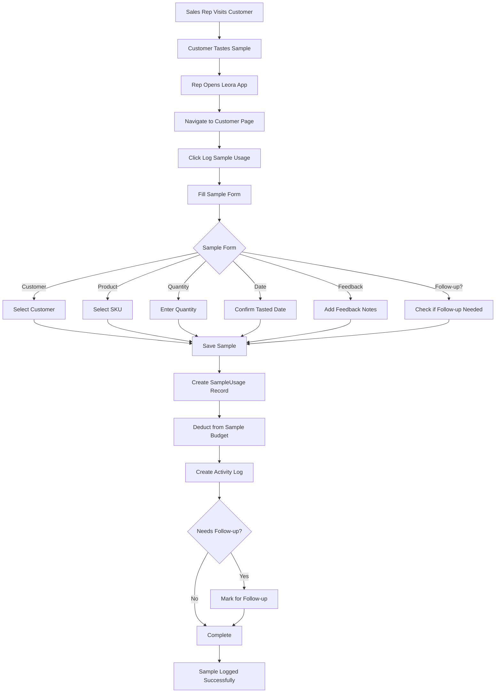

---

## Sample Conversion Tracking Flow

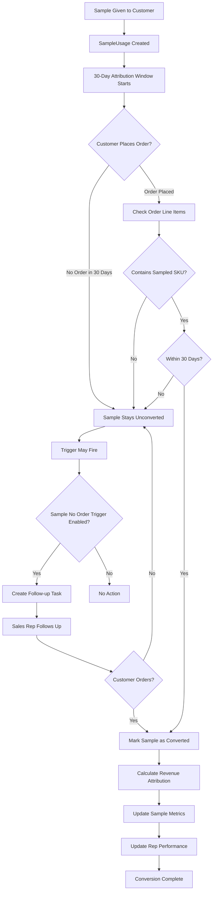

---

## Sample Analytics Calculation Flow

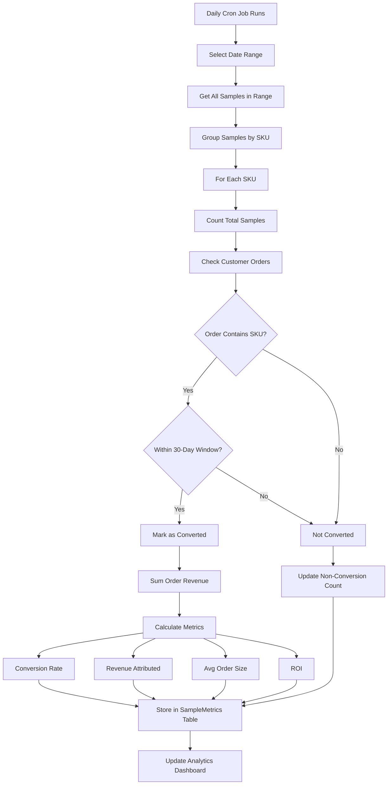

---

## Trigger Processing Workflow

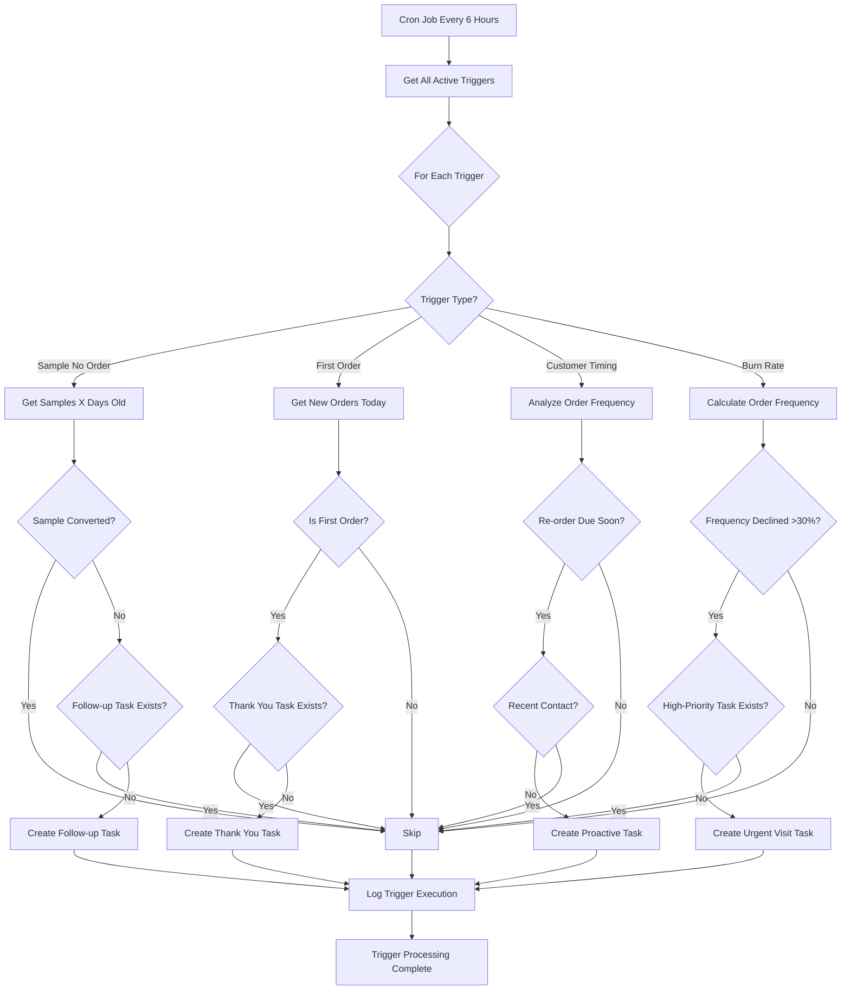

---

## AI Recommendation Generation Flow

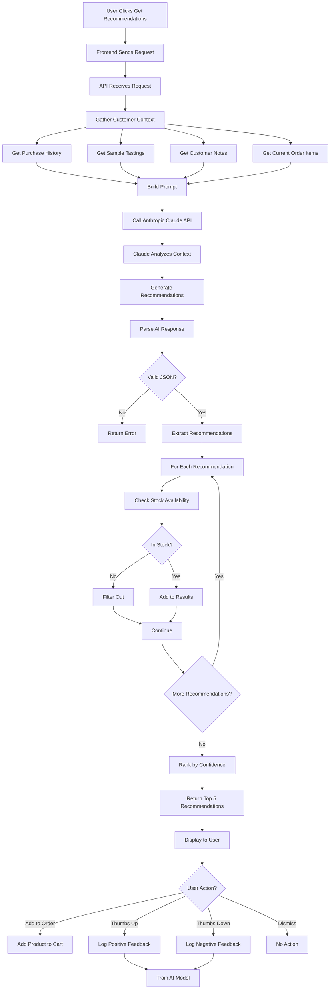

---

## Complete Phase 3 System Architecture

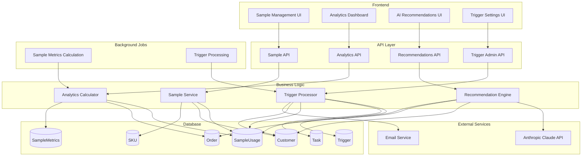

---

## User Journey: From Sample to Order

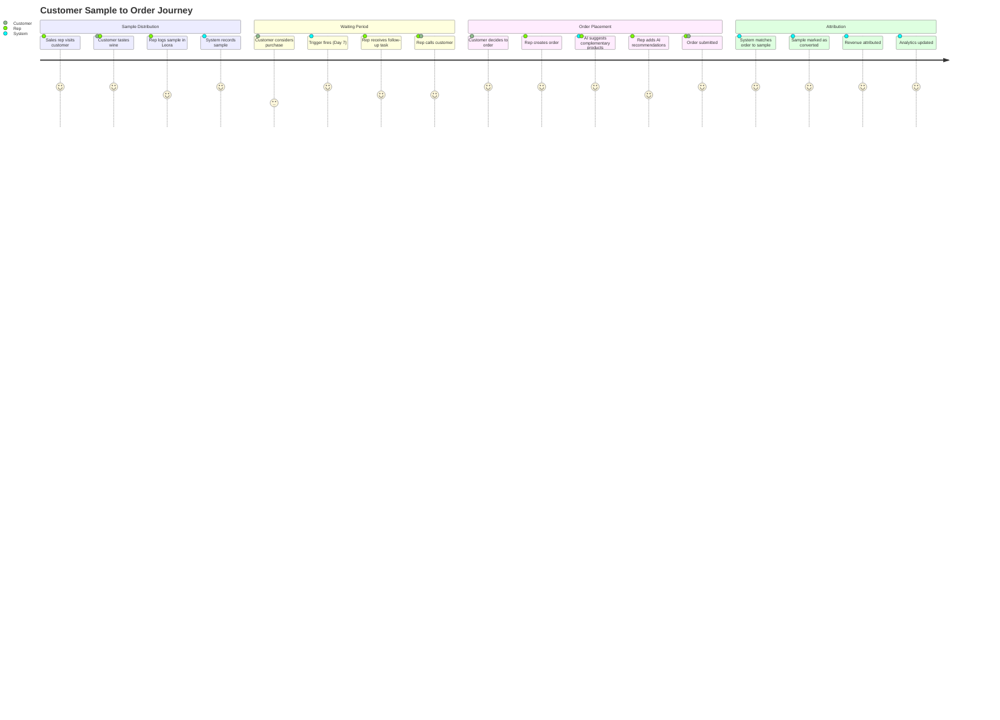

---

## Sample Budget Tracking

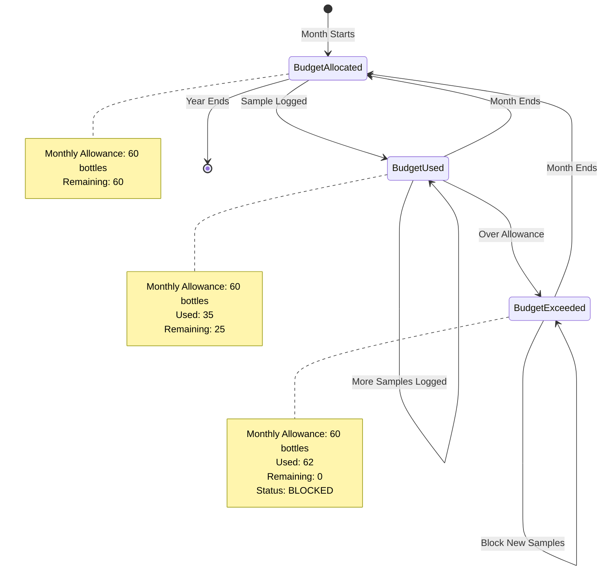

---

## Conversion Attribution State Machine

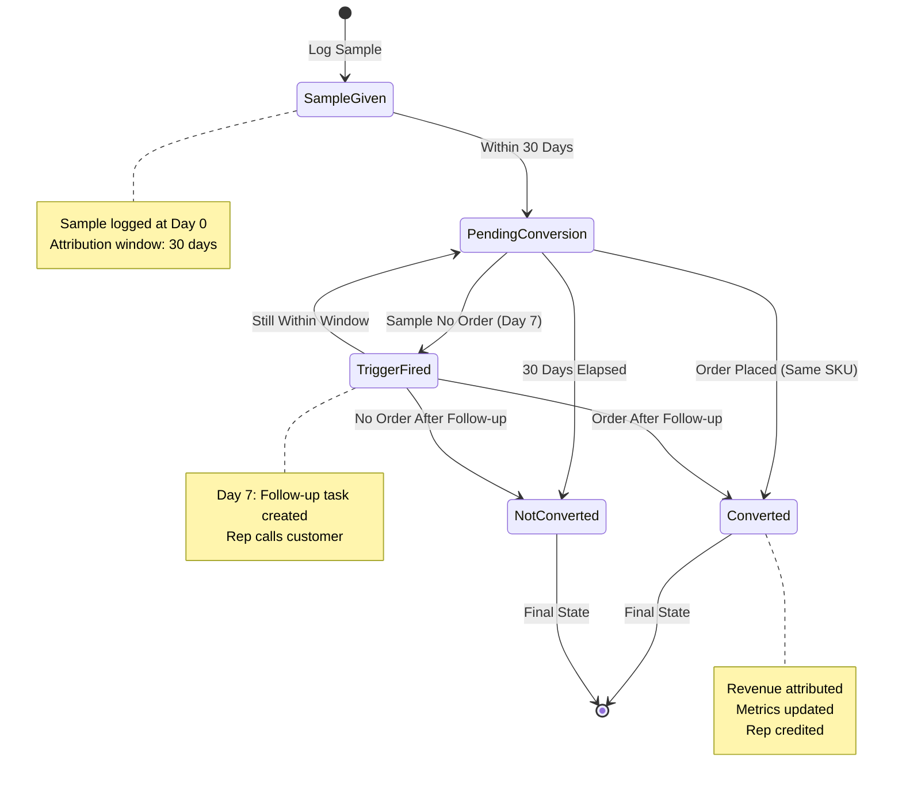

---

## Trigger Decision Tree

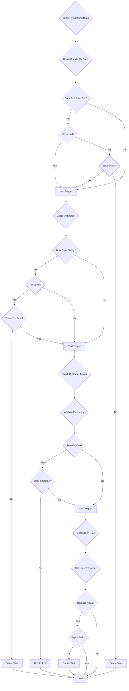

---

## Rep Performance Calculation

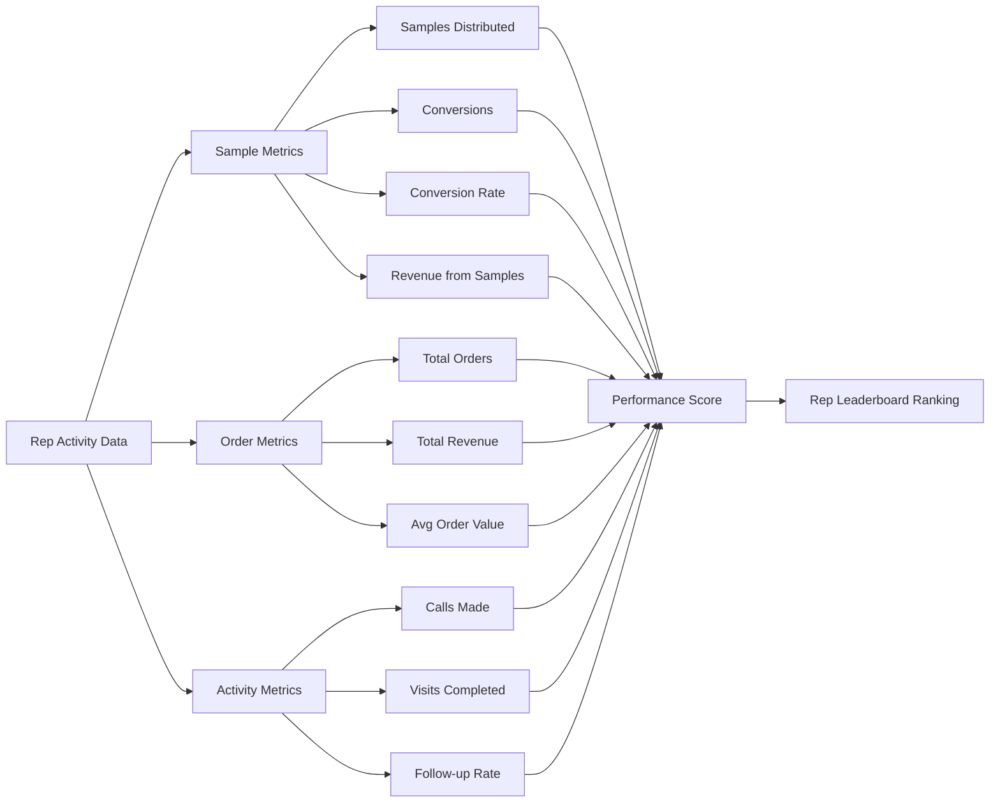

---

## Data Flow: Sample to Analytics

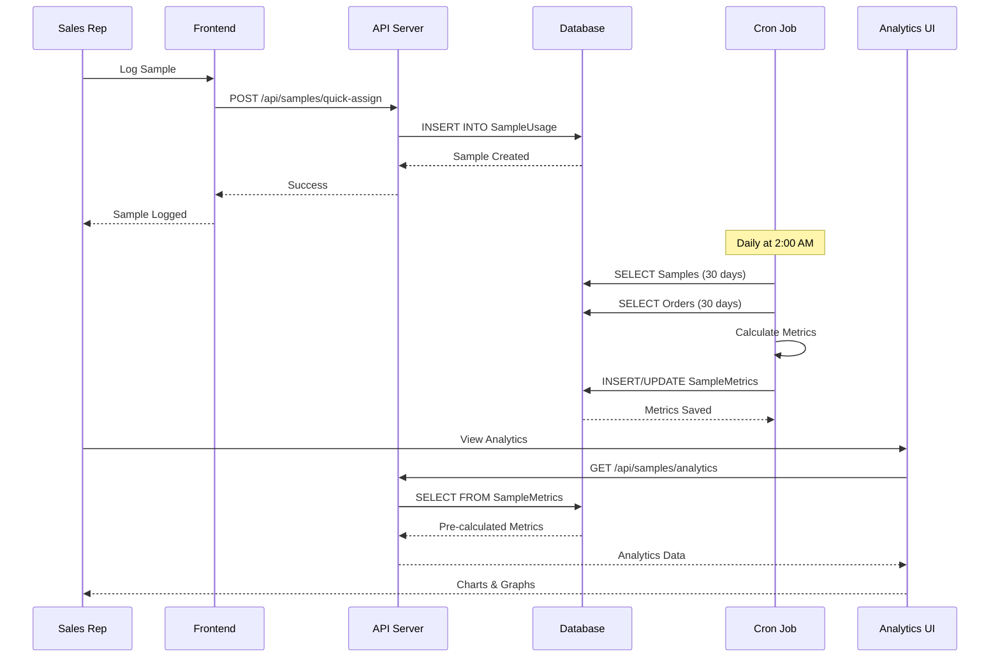

---

## Mobile Sample Logging Flow

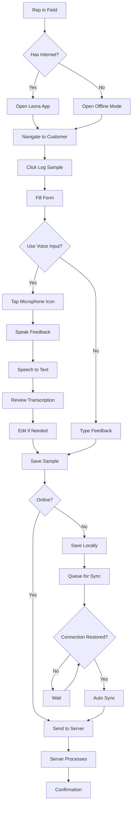

---

## Legend

**Diagram Types Used**:
- **Flowchart** (`graph`): Process flows and decision trees
- **Sequence Diagram** (`sequenceDiagram`): System interactions over time
- **State Diagram** (`stateDiagram`): State transitions
- **Journey Map** (`journey`): User experience flows

**Common Symbols**:
- **Rectangle**: Process step
- **Diamond**: Decision point
- **Circle**: Start/End point
- **Arrows**: Flow direction
- **Subgraph**: Grouped components

---

## Using These Diagrams

These diagrams can be rendered in:
- **Markdown viewers** that support Mermaid
- **GitHub** (native Mermaid support)
- **VS Code** (with Mermaid extension)
- **Documentation sites** (MkDocs, Docusaurus, etc.)
- **Mermaid Live Editor**: https://mermaid.live

---

**Document Version**: 1.0
**Last Updated**: October 25, 2024
**Maintained by**: Technical Documentation Team
