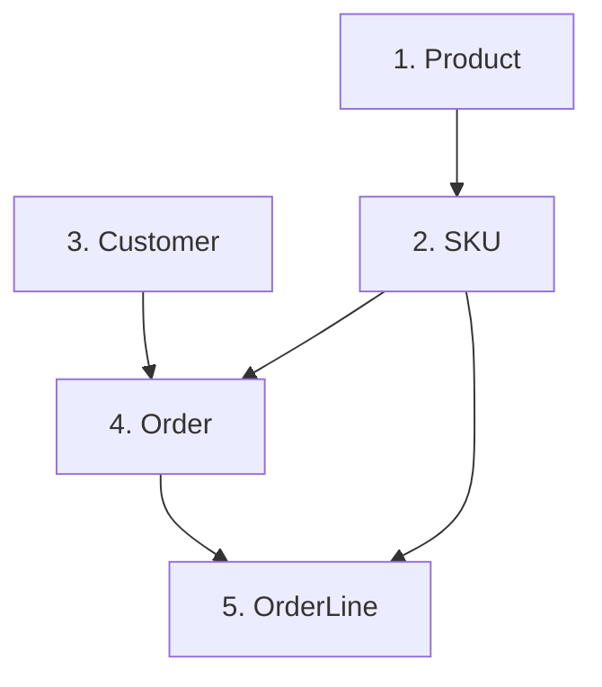

# Schema Transformation Guide: Well Crafted → Lovable

**Generated:** 2025-10-23
**Purpose:** Complete mapping and transformation specification for migrating data from Well Crafted (PascalCase) to Lovable (lowercase) schema

---

## Executive Summary

### Critical Differences
1. **Table Naming:** PascalCase → lowercase
2. **Column Naming:** camelCase → lowercase
3. **Tenant Architecture:** Well Crafted uses `tenantId` (multi-tenant), Lovable does not (single tenant)
4. **Table Name Variance:** `Sku` → `skus` (singular → plural)
5. **UUID Management:** Different UUID generation, requires mapping strategy
6. **Foreign Key Constraints:** Lovable needs explicit constraint definitions

### Data Loss Risks
⚠️ **CRITICAL:** The following data will be **DROPPED** during transformation:
- All `tenantId` values (Well Crafted is multi-tenant, Lovable is single-tenant)
- Solution: If multi-tenant data exists, must filter to single tenant before migration

---

## Complete Field Mapping

### 1. Customer Table Transformation

#### Well Crafted Schema (`Customer`)
```typescript
interface WellCraftedCustomer {
  customerId: string;        // UUID
  tenantId: string;         // UUID - WILL BE DROPPED
  email: string;
  firstName: string;
  lastName: string;
  phone: string | null;
  createdAt: Date;
  updatedAt: Date;
}
```

#### Lovable Schema (`customer`)
```typescript
interface LovableCustomer {
  customerid: string;        // UUID
  email: string;
  firstname: string;
  lastname: string;
  phone: string | null;
  createdat: string;         // timestamp with time zone
  updatedat: string;         // timestamp with time zone
}
```

#### Field Mapping
| Well Crafted Field | Lovable Field | Transformation | Required | Notes |
|-------------------|---------------|----------------|----------|-------|
| `customerId` | `customerid` | Lowercase, UUID preserved | Yes | Primary key |
| `tenantId` | *(removed)* | **DROPPED** | N/A | Multi-tenant feature not in Lovable |
| `email` | `email` | No transformation | Yes | Direct copy |
| `firstName` | `firstname` | Lowercase | Yes | Direct copy |
| `lastName` | `lastname` | Lowercase | Yes | Direct copy |
| `phone` | `phone` | No transformation | No | Nullable, direct copy |
| `createdAt` | `createdat` | Lowercase, Date → ISO string | Yes | Format: ISO 8601 |
| `updatedAt` | `updatedat` | Lowercase, Date → ISO string | Yes | Format: ISO 8601 |

---

### 2. Order Table Transformation

#### Well Crafted Schema (`Order`)
```typescript
interface WellCraftedOrder {
  orderId: string;          // UUID
  tenantId: string;         // UUID - WILL BE DROPPED
  customerId: string;       // UUID
  orderedAt: Date;
  status: string;
  totalAmount: number;      // Decimal
  createdAt: Date;
  updatedAt: Date;
}
```

#### Lovable Schema (`order`)
```typescript
interface LovableOrder {
  orderid: string;          // UUID
  customerid: string;       // UUID
  orderedat: string;        // timestamp with time zone
  status: string;
  totalamount: number;      // numeric
  createdat: string;        // timestamp with time zone
  updatedat: string;        // timestamp with time zone
}
```

#### Field Mapping
| Well Crafted Field | Lovable Field | Transformation | Required | Notes |
|-------------------|---------------|----------------|----------|-------|
| `orderId` | `orderid` | Lowercase, UUID preserved | Yes | Primary key |
| `tenantId` | *(removed)* | **DROPPED** | N/A | Multi-tenant feature not in Lovable |
| `customerId` | `customerid` | Lowercase, UUID preserved | Yes | Foreign key to customer |
| `orderedAt` | `orderedat` | Lowercase, Date → ISO string | Yes | Order timestamp |
| `status` | `status` | No transformation | Yes | Direct copy |
| `totalAmount` | `totalamount` | Lowercase, decimal preserved | Yes | Numeric precision maintained |
| `createdAt` | `createdat` | Lowercase, Date → ISO string | Yes | Format: ISO 8601 |
| `updatedAt` | `updatedat` | Lowercase, Date → ISO string | Yes | Format: ISO 8601 |

---

### 3. OrderLine Table Transformation

#### Well Crafted Schema (`OrderLine`)
```typescript
interface WellCraftedOrderLine {
  orderLineId: string;      // UUID
  tenantId: string;         // UUID - WILL BE DROPPED
  orderId: string;          // UUID
  skuId: string;            // UUID
  quantity: number;         // Integer
  pricePerUnit: number;     // Decimal
  createdAt: Date;
  updatedAt: Date;
}
```

#### Lovable Schema (`orderline`)
```typescript
interface LovableOrderLine {
  orderlineid: string;      // UUID
  orderid: string;          // UUID
  skuid: string;            // UUID
  quantity: number;         // integer
  priceperunit: number;     // numeric
  createdat: string;        // timestamp with time zone
  updatedat: string;        // timestamp with time zone
}
```

#### Field Mapping
| Well Crafted Field | Lovable Field | Transformation | Required | Notes |
|-------------------|---------------|----------------|----------|-------|
| `orderLineId` | `orderlineid` | Lowercase, UUID preserved | Yes | Primary key |
| `tenantId` | *(removed)* | **DROPPED** | N/A | Multi-tenant feature not in Lovable |
| `orderId` | `orderid` | Lowercase, UUID preserved | Yes | Foreign key to order |
| `skuId` | `skuid` | Lowercase, UUID preserved | Yes | Foreign key to skus |
| `quantity` | `quantity` | No transformation | Yes | Integer, direct copy |
| `pricePerUnit` | `priceperunit` | Lowercase, decimal preserved | Yes | Numeric precision maintained |
| `createdAt` | `createdat` | Lowercase, Date → ISO string | Yes | Format: ISO 8601 |
| `updatedAt` | `updatedat` | Lowercase, Date → ISO string | Yes | Format: ISO 8601 |

---

### 4. Sku/Skus Table Transformation

#### Well Crafted Schema (`Sku`)
```typescript
interface WellCraftedSku {
  skuId: string;            // UUID
  tenantId: string;         // UUID - WILL BE DROPPED
  productId: string;        // UUID
  code: string;             // SKU code
  size: string | null;
  color: string | null;
  stockQuantity: number;    // Integer
  price: number;            // Decimal
  createdAt: Date;
  updatedAt: Date;
}
```

#### Lovable Schema (`skus`) ⚠️ **Note: Plural table name**
```typescript
interface LovableSku {
  skuid: string;            // UUID
  productid: string;        // UUID
  code: string;             // text
  size: string | null;      // text
  color: string | null;     // text
  stockquantity: number;    // integer
  price: number;            // numeric
  createdat: string;        // timestamp with time zone
  updatedat: string;        // timestamp with time zone
}
```

#### Field Mapping
| Well Crafted Field | Lovable Field | Transformation | Required | Notes |
|-------------------|---------------|----------------|----------|-------|
| `skuId` | `skuid` | Lowercase, UUID preserved | Yes | Primary key |
| `tenantId` | *(removed)* | **DROPPED** | N/A | Multi-tenant feature not in Lovable |
| `productId` | `productid` | Lowercase, UUID preserved | Yes | Foreign key to product |
| `code` | `code` | No transformation | Yes | SKU identifier |
| `size` | `size` | No transformation | No | Nullable, direct copy |
| `color` | `color` | No transformation | No | Nullable, direct copy |
| `stockQuantity` | `stockquantity` | Lowercase | Yes | Integer, direct copy |
| `price` | `price` | No transformation | Yes | Numeric precision maintained |
| `createdAt` | `createdat` | Lowercase, Date → ISO string | Yes | Format: ISO 8601 |
| `updatedAt` | `updatedat` | Lowercase, Date → ISO string | Yes | Format: ISO 8601 |

---

### 5. Product Table Transformation

#### Well Crafted Schema (`Product`)
```typescript
interface WellCraftedProduct {
  productId: string;        // UUID
  tenantId: string;         // UUID - WILL BE DROPPED
  name: string;
  description: string | null;
  category: string | null;
  createdAt: Date;
  updatedAt: Date;
}
```

#### Lovable Schema (`product`)
```typescript
interface LovableProduct {
  productid: string;        // UUID
  name: string;             // text
  description: string | null; // text
  category: string | null;  // text
  createdat: string;        // timestamp with time zone
  updatedat: string;        // timestamp with time zone
}
```

#### Field Mapping
| Well Crafted Field | Lovable Field | Transformation | Required | Notes |
|-------------------|---------------|----------------|----------|-------|
| `productId` | `productid` | Lowercase, UUID preserved | Yes | Primary key |
| `tenantId` | *(removed)* | **DROPPED** | N/A | Multi-tenant feature not in Lovable |
| `name` | `name` | No transformation | Yes | Direct copy |
| `description` | `description` | No transformation | No | Nullable, direct copy |
| `category` | `category` | No transformation | No | Nullable, direct copy |
| `createdAt` | `createdat` | Lowercase, Date → ISO string | Yes | Format: ISO 8601 |
| `updatedAt` | `updatedat` | Lowercase, Date → ISO string | Yes | Format: ISO 8601 |

---

## Transformation Functions

### TypeScript Implementation

```typescript
// ============================================================================
// TRANSFORMATION UTILITIES
// ============================================================================

/**
 * Convert camelCase or PascalCase to lowercase
 */
function toLowerCase(str: string): string {
  return str.toLowerCase();
}

/**
 * Convert JavaScript Date to ISO 8601 string for PostgreSQL
 */
function dateToISO(date: Date): string {
  return date.toISOString();
}

/**
 * Validate UUID format
 */
function isValidUUID(uuid: string): boolean {
  const uuidRegex = /^[0-9a-f]{8}-[0-9a-f]{4}-[0-9a-f]{4}-[0-9a-f]{4}-[0-9a-f]{12}$/i;
  return uuidRegex.test(uuid);
}

// ============================================================================
// CUSTOMER TRANSFORMATION
// ============================================================================

interface TransformCustomerOptions {
  validateUUIDs?: boolean;
  preserveTimestamps?: boolean;
}

function transformCustomer(
  wcCustomer: WellCraftedCustomer,
  options: TransformCustomerOptions = {}
): LovableCustomer {
  const { validateUUIDs = true, preserveTimestamps = true } = options;

  // Validate UUID if requested
  if (validateUUIDs && !isValidUUID(wcCustomer.customerId)) {
    throw new Error(`Invalid customer UUID: ${wcCustomer.customerId}`);
  }

  return {
    customerid: wcCustomer.customerId, // Preserve UUID, lowercase field name
    email: wcCustomer.email,
    firstname: wcCustomer.firstName,
    lastname: wcCustomer.lastName,
    phone: wcCustomer.phone,
    createdat: preserveTimestamps
      ? dateToISO(wcCustomer.createdAt)
      : new Date().toISOString(),
    updatedat: preserveTimestamps
      ? dateToISO(wcCustomer.updatedAt)
      : new Date().toISOString(),
  };
}

// ============================================================================
// ORDER TRANSFORMATION
// ============================================================================

interface TransformOrderOptions {
  validateUUIDs?: boolean;
  validateCustomerExists?: (customerId: string) => Promise<boolean>;
}

async function transformOrder(
  wcOrder: WellCraftedOrder,
  options: TransformOrderOptions = {}
): Promise<LovableOrder> {
  const { validateUUIDs = true, validateCustomerExists } = options;

  // Validate UUIDs
  if (validateUUIDs) {
    if (!isValidUUID(wcOrder.orderId)) {
      throw new Error(`Invalid order UUID: ${wcOrder.orderId}`);
    }
    if (!isValidUUID(wcOrder.customerId)) {
      throw new Error(`Invalid customer UUID: ${wcOrder.customerId}`);
    }
  }

  // Validate customer existence if validator provided
  if (validateCustomerExists) {
    const exists = await validateCustomerExists(wcOrder.customerId);
    if (!exists) {
      throw new Error(`Customer ${wcOrder.customerId} does not exist in Lovable DB`);
    }
  }

  return {
    orderid: wcOrder.orderId,
    customerid: wcOrder.customerId,
    orderedat: dateToISO(wcOrder.orderedAt),
    status: wcOrder.status,
    totalamount: wcOrder.totalAmount,
    createdat: dateToISO(wcOrder.createdAt),
    updatedat: dateToISO(wcOrder.updatedAt),
  };
}

// ============================================================================
// ORDERLINE TRANSFORMATION
// ============================================================================

interface TransformOrderLineOptions {
  validateUUIDs?: boolean;
  validateOrderExists?: (orderId: string) => Promise<boolean>;
  validateSkuExists?: (skuId: string) => Promise<boolean>;
}

async function transformOrderLine(
  wcOrderLine: WellCraftedOrderLine,
  options: TransformOrderLineOptions = {}
): Promise<LovableOrderLine> {
  const { validateUUIDs = true, validateOrderExists, validateSkuExists } = options;

  // Validate UUIDs
  if (validateUUIDs) {
    if (!isValidUUID(wcOrderLine.orderLineId)) {
      throw new Error(`Invalid orderLine UUID: ${wcOrderLine.orderLineId}`);
    }
    if (!isValidUUID(wcOrderLine.orderId)) {
      throw new Error(`Invalid order UUID: ${wcOrderLine.orderId}`);
    }
    if (!isValidUUID(wcOrderLine.skuId)) {
      throw new Error(`Invalid sku UUID: ${wcOrderLine.skuId}`);
    }
  }

  // Validate foreign key references
  if (validateOrderExists) {
    const orderExists = await validateOrderExists(wcOrderLine.orderId);
    if (!orderExists) {
      throw new Error(`Order ${wcOrderLine.orderId} does not exist in Lovable DB`);
    }
  }

  if (validateSkuExists) {
    const skuExists = await validateSkuExists(wcOrderLine.skuId);
    if (!skuExists) {
      throw new Error(`SKU ${wcOrderLine.skuId} does not exist in Lovable DB`);
    }
  }

  return {
    orderlineid: wcOrderLine.orderLineId,
    orderid: wcOrderLine.orderId,
    skuid: wcOrderLine.skuId,
    quantity: wcOrderLine.quantity,
    priceperunit: wcOrderLine.pricePerUnit,
    createdat: dateToISO(wcOrderLine.createdAt),
    updatedat: dateToISO(wcOrderLine.updatedAt),
  };
}

// ============================================================================
// SKU TRANSFORMATION
// ============================================================================

interface TransformSkuOptions {
  validateUUIDs?: boolean;
  validateProductExists?: (productId: string) => Promise<boolean>;
  validateStockQuantity?: boolean;
}

async function transformSku(
  wcSku: WellCraftedSku,
  options: TransformSkuOptions = {}
): Promise<LovableSku> {
  const { validateUUIDs = true, validateProductExists, validateStockQuantity = true } = options;

  // Validate UUIDs
  if (validateUUIDs) {
    if (!isValidUUID(wcSku.skuId)) {
      throw new Error(`Invalid sku UUID: ${wcSku.skuId}`);
    }
    if (!isValidUUID(wcSku.productId)) {
      throw new Error(`Invalid product UUID: ${wcSku.productId}`);
    }
  }

  // Validate product reference
  if (validateProductExists) {
    const productExists = await validateProductExists(wcSku.productId);
    if (!productExists) {
      throw new Error(`Product ${wcSku.productId} does not exist in Lovable DB`);
    }
  }

  // Validate stock quantity
  if (validateStockQuantity && wcSku.stockQuantity < 0) {
    throw new Error(`Invalid stock quantity: ${wcSku.stockQuantity} (must be >= 0)`);
  }

  return {
    skuid: wcSku.skuId,
    productid: wcSku.productId,
    code: wcSku.code,
    size: wcSku.size,
    color: wcSku.color,
    stockquantity: wcSku.stockQuantity,
    price: wcSku.price,
    createdat: dateToISO(wcSku.createdAt),
    updatedat: dateToISO(wcSku.updatedAt),
  };
}

// ============================================================================
// PRODUCT TRANSFORMATION
// ============================================================================

interface TransformProductOptions {
  validateUUIDs?: boolean;
  trimStrings?: boolean;
}

function transformProduct(
  wcProduct: WellCraftedProduct,
  options: TransformProductOptions = {}
): LovableProduct {
  const { validateUUIDs = true, trimStrings = true } = options;

  // Validate UUID
  if (validateUUIDs && !isValidUUID(wcProduct.productId)) {
    throw new Error(`Invalid product UUID: ${wcProduct.productId}`);
  }

  return {
    productid: wcProduct.productId,
    name: trimStrings ? wcProduct.name.trim() : wcProduct.name,
    description: wcProduct.description
      ? (trimStrings ? wcProduct.description.trim() : wcProduct.description)
      : null,
    category: wcProduct.category
      ? (trimStrings ? wcProduct.category.trim() : wcProduct.category)
      : null,
    createdat: dateToISO(wcProduct.createdAt),
    updatedat: dateToISO(wcProduct.updatedAt),
  };
}

// ============================================================================
// BATCH TRANSFORMATION
// ============================================================================

interface BatchTransformOptions {
  batchSize?: number;
  onProgress?: (processed: number, total: number) => void;
  onError?: (error: Error, record: any) => void;
  stopOnError?: boolean;
}

async function batchTransformCustomers(
  wcCustomers: WellCraftedCustomer[],
  options: BatchTransformOptions = {}
): Promise<LovableCustomer[]> {
  const { batchSize = 100, onProgress, onError, stopOnError = false } = options;
  const results: LovableCustomer[] = [];

  for (let i = 0; i < wcCustomers.length; i += batchSize) {
    const batch = wcCustomers.slice(i, i + batchSize);

    for (const customer of batch) {
      try {
        const transformed = transformCustomer(customer);
        results.push(transformed);
      } catch (error) {
        if (onError) {
          onError(error as Error, customer);
        }
        if (stopOnError) {
          throw error;
        }
      }
    }

    if (onProgress) {
      onProgress(Math.min(i + batchSize, wcCustomers.length), wcCustomers.length);
    }
  }

  return results;
}

// Similar batch functions for other entities...
```

---

## Migration Strategy

### Pre-Migration Checklist

- [ ] **Identify Tenant**: If Well Crafted has multiple tenants, identify which `tenantId` to migrate
- [ ] **Backup Both Databases**: Full backup before any migration
- [ ] **Test Environment**: Run migration in test environment first
- [ ] **Foreign Key Order**: Migrate in correct order (Product → Customer → SKU → Order → OrderLine)
- [ ] **UUID Mapping**: Create UUID mapping table if UUIDs will be regenerated

### Migration Order (Critical)



**Correct Migration Sequence:**
1. **Product** (no foreign keys)
2. **SKU** (depends on Product)
3. **Customer** (no foreign keys)
4. **Order** (depends on Customer)
5. **OrderLine** (depends on Order and SKU)

### Sample Migration Script

```typescript
async function migrateDatabase() {
  const wcDb = await connectToWellCrafted();
  const lovableDb = await connectToLovable();

  try {
    // Step 1: Migrate Products
    console.log('Step 1: Migrating products...');
    const wcProducts = await wcDb.query('SELECT * FROM "Product" WHERE "tenantId" = $1', [targetTenantId]);
    const lovableProducts = wcProducts.rows.map(p => transformProduct(p));
    await lovableDb.batchInsert('product', lovableProducts);

    // Step 2: Migrate SKUs
    console.log('Step 2: Migrating SKUs...');
    const wcSkus = await wcDb.query('SELECT * FROM "Sku" WHERE "tenantId" = $1', [targetTenantId]);
    const lovableSkus = wcSkus.rows.map(s => transformSku(s));
    await lovableDb.batchInsert('skus', lovableSkus); // Note: plural table name!

    // Step 3: Migrate Customers
    console.log('Step 3: Migrating customers...');
    const wcCustomers = await wcDb.query('SELECT * FROM "Customer" WHERE "tenantId" = $1', [targetTenantId]);
    const lovableCustomers = wcCustomers.rows.map(c => transformCustomer(c));
    await lovableDb.batchInsert('customer', lovableCustomers);

    // Step 4: Migrate Orders
    console.log('Step 4: Migrating orders...');
    const wcOrders = await wcDb.query('SELECT * FROM "Order" WHERE "tenantId" = $1', [targetTenantId]);
    const lovableOrders = await Promise.all(wcOrders.rows.map(o => transformOrder(o)));
    await lovableDb.batchInsert('order', lovableOrders);

    // Step 5: Migrate OrderLines
    console.log('Step 5: Migrating order lines...');
    const wcOrderLines = await wcDb.query('SELECT * FROM "OrderLine" WHERE "tenantId" = $1', [targetTenantId]);
    const lovableOrderLines = await Promise.all(wcOrderLines.rows.map(ol => transformOrderLine(ol)));
    await lovableDb.batchInsert('orderline', lovableOrderLines);

    console.log('✅ Migration completed successfully!');
  } catch (error) {
    console.error('❌ Migration failed:', error);
    throw error;
  }
}
```

---

## Test Data for Validation

### Test Case 1: Complete Customer Journey

```typescript
// Well Crafted Test Data
const wcTestData = {
  tenant: {
    tenantId: '00000000-0000-0000-0000-000000000001',
  },
  product: {
    productId: '11111111-1111-1111-1111-111111111111',
    tenantId: '00000000-0000-0000-0000-000000000001',
    name: 'Premium T-Shirt',
    description: 'High quality cotton t-shirt',
    category: 'Apparel',
    createdAt: new Date('2024-01-01T00:00:00Z'),
    updatedAt: new Date('2024-01-01T00:00:00Z'),
  },
  sku: {
    skuId: '22222222-2222-2222-2222-222222222222',
    tenantId: '00000000-0000-0000-0000-000000000001',
    productId: '11111111-1111-1111-1111-111111111111',
    code: 'TSHIRT-BLK-M',
    size: 'M',
    color: 'Black',
    stockQuantity: 100,
    price: 29.99,
    createdAt: new Date('2024-01-01T00:00:00Z'),
    updatedAt: new Date('2024-01-01T00:00:00Z'),
  },
  customer: {
    customerId: '33333333-3333-3333-3333-333333333333',
    tenantId: '00000000-0000-0000-0000-000000000001',
    email: 'john.doe@example.com',
    firstName: 'John',
    lastName: 'Doe',
    phone: '+1-555-1234',
    createdAt: new Date('2024-01-15T10:30:00Z'),
    updatedAt: new Date('2024-01-15T10:30:00Z'),
  },
  order: {
    orderId: '44444444-4444-4444-4444-444444444444',
    tenantId: '00000000-0000-0000-0000-000000000001',
    customerId: '33333333-3333-3333-3333-333333333333',
    orderedAt: new Date('2024-01-20T14:00:00Z'),
    status: 'pending',
    totalAmount: 59.98,
    createdAt: new Date('2024-01-20T14:00:00Z'),
    updatedAt: new Date('2024-01-20T14:00:00Z'),
  },
  orderLine: {
    orderLineId: '55555555-5555-5555-5555-555555555555',
    tenantId: '00000000-0000-0000-0000-000000000001',
    orderId: '44444444-4444-4444-4444-444444444444',
    skuId: '22222222-2222-2222-2222-222222222222',
    quantity: 2,
    pricePerUnit: 29.99,
    createdAt: new Date('2024-01-20T14:00:00Z'),
    updatedAt: new Date('2024-01-20T14:00:00Z'),
  },
};

// Expected Lovable Output
const expectedLovableData = {
  product: {
    productid: '11111111-1111-1111-1111-111111111111',
    name: 'Premium T-Shirt',
    description: 'High quality cotton t-shirt',
    category: 'Apparel',
    createdat: '2024-01-01T00:00:00.000Z',
    updatedat: '2024-01-01T00:00:00.000Z',
  },
  sku: {
    skuid: '22222222-2222-2222-2222-222222222222',
    productid: '11111111-1111-1111-1111-111111111111',
    code: 'TSHIRT-BLK-M',
    size: 'M',
    color: 'Black',
    stockquantity: 100,
    price: 29.99,
    createdat: '2024-01-01T00:00:00.000Z',
    updatedat: '2024-01-01T00:00:00.000Z',
  },
  customer: {
    customerid: '33333333-3333-3333-3333-333333333333',
    email: 'john.doe@example.com',
    firstname: 'John',
    lastname: 'Doe',
    phone: '+1-555-1234',
    createdat: '2024-01-15T10:30:00.000Z',
    updatedat: '2024-01-15T10:30:00.000Z',
  },
  order: {
    orderid: '44444444-4444-4444-4444-444444444444',
    customerid: '33333333-3333-3333-3333-333333333333',
    orderedat: '2024-01-20T14:00:00.000Z',
    status: 'pending',
    totalamount: 59.98,
    createdat: '2024-01-20T14:00:00.000Z',
    updatedat: '2024-01-20T14:00:00.000Z',
  },
  orderline: {
    orderlineid: '55555555-5555-5555-5555-555555555555',
    orderid: '44444444-4444-4444-4444-444444444444',
    skuid: '22222222-2222-2222-2222-222222222222',
    quantity: 2,
    priceperunit: 29.99,
    createdat: '2024-01-20T14:00:00.000Z',
    updatedat: '2024-01-20T14:00:00.000Z',
  },
};

// Validation Test
function validateTransformation() {
  // Transform and compare
  const transformedProduct = transformProduct(wcTestData.product);
  assert.deepEqual(transformedProduct, expectedLovableData.product);

  const transformedSku = transformSku(wcTestData.sku);
  assert.deepEqual(transformedSku, expectedLovableData.sku);

  const transformedCustomer = transformCustomer(wcTestData.customer);
  assert.deepEqual(transformedCustomer, expectedLovableData.customer);

  const transformedOrder = await transformOrder(wcTestData.order);
  assert.deepEqual(transformedOrder, expectedLovableData.order);

  const transformedOrderLine = await transformOrderLine(wcTestData.orderLine);
  assert.deepEqual(transformedOrderLine, expectedLovableData.orderline);

  console.log('✅ All transformations validated successfully!');
}
```

---

## Foreign Key Constraints to Add

Lovable database needs these foreign key constraints:

```sql
-- Add foreign key constraints to Lovable database

-- Order → Customer
ALTER TABLE "order"
ADD CONSTRAINT fk_order_customer
FOREIGN KEY (customerid) REFERENCES customer(customerid)
ON DELETE RESTRICT ON UPDATE CASCADE;

-- OrderLine → Order
ALTER TABLE orderline
ADD CONSTRAINT fk_orderline_order
FOREIGN KEY (orderid) REFERENCES "order"(orderid)
ON DELETE CASCADE ON UPDATE CASCADE;

-- OrderLine → SKU
ALTER TABLE orderline
ADD CONSTRAINT fk_orderline_sku
FOREIGN KEY (skuid) REFERENCES skus(skuid)
ON DELETE RESTRICT ON UPDATE CASCADE;

-- SKU → Product
ALTER TABLE skus
ADD CONSTRAINT fk_sku_product
FOREIGN KEY (productid) REFERENCES product(productid)
ON DELETE RESTRICT ON UPDATE CASCADE;
```

---

## Critical Warnings

### ⚠️ Data Loss Warnings

1. **Tenant ID Loss**: All `tenantId` fields will be **permanently dropped**
   - **Impact**: Cannot preserve multi-tenant architecture
   - **Mitigation**: Filter to single tenant before migration OR add `tenantId` to Lovable schema

2. **UUID Regeneration**: If UUIDs are regenerated, all references break
   - **Impact**: Foreign key relationships will fail
   - **Mitigation**: Preserve original UUIDs during transformation

3. **Timestamp Precision**: PostgreSQL may handle timestamp precision differently
   - **Impact**: Minor timestamp differences (microseconds)
   - **Mitigation**: Use ISO 8601 string format for consistency

### ⚠️ Validation Requirements

Before migration:
- [ ] Verify all foreign key relationships exist
- [ ] Check for orphaned records (e.g., OrderLine without Order)
- [ ] Validate UUID format consistency
- [ ] Test transformation functions with sample data
- [ ] Backup both databases

After migration:
- [ ] Verify record counts match (minus dropped tenant data)
- [ ] Validate foreign key integrity
- [ ] Check for data type conversions (decimal precision)
- [ ] Test application functionality with migrated data

---

## Summary Statistics

### Field Transformation Patterns

| Transformation Type | Count | Examples |
|---------------------|-------|----------|
| Lowercase only | 35 | `customerId` → `customerid` |
| Date → ISO string | 10 | `createdAt` → `createdat` |
| Removed (tenantId) | 5 | `tenantId` → *(dropped)* |
| No change | 12 | `email`, `status`, `quantity` |
| **Total fields** | **62** | Across 5 tables |

### Critical Mappings

1. **Table Names**: 4 lowercase transformations + 1 singular→plural (`Sku` → `skus`)
2. **Tenant Data**: 5 `tenantId` fields **DROPPED**
3. **UUID Fields**: 15 UUID fields preserved (IDs and foreign keys)
4. **Timestamps**: 10 timestamp fields require Date → ISO conversion
5. **Foreign Keys**: 4 foreign key constraints need to be added

---

## Next Steps

1. **Review this guide** for accuracy
2. **Create transformation functions** in `/Users/greghogue/Leora2/src/database-investigation/transformers.ts`
3. **Build test suite** to validate transformations
4. **Create migration scripts** for batch processing
5. **Execute test migration** in staging environment
6. **Validate data integrity** before production migration

---

**Document Status:** ✅ Complete
**Last Updated:** 2025-10-23
**Author:** Schema Transformation Analyst Agent
