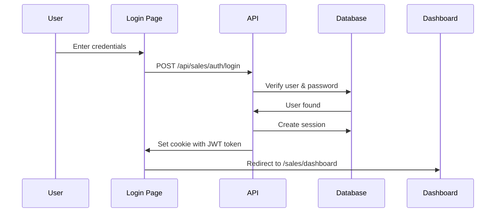
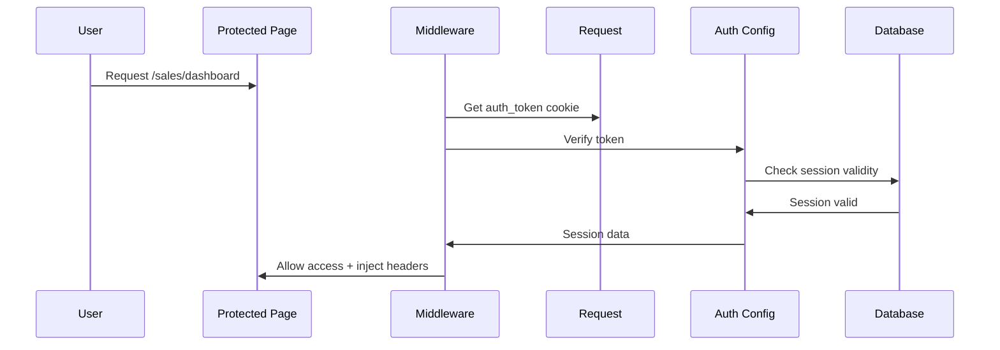

# Package 4: Authentication & Security

Authentication, session management, and middleware for securing the Lovable migration.

## Files Included

1. **auth-config.ts** - Core authentication functions and helpers
2. **login-page.tsx** - Login page component
3. **middleware.ts** - Route protection and session validation

## Setup

### 1. Install Dependencies

```bash
npm install @supabase/supabase-js bcryptjs jsonwebtoken
npm install -D @types/bcryptjs @types/jsonwebtoken
```

### 2. Environment Variables

Add to `.env.local`:

```env
# Supabase
NEXT_PUBLIC_SUPABASE_URL="https://your-project.supabase.co"
NEXT_PUBLIC_SUPABASE_ANON_KEY="your-anon-key"
SUPABASE_SERVICE_ROLE_KEY="your-service-role-key"

# JWT
JWT_SECRET="your-secret-key-minimum-32-characters-long"

# Session
SESSION_MAX_AGE="604800" # 7 days in seconds
```

### 3. Create Session Table

Add to your Prisma schema:

```prisma
model Session {
  id        String   @id @default(uuid())
  tenantId  String
  userId    String
  token     String   @unique
  role      String
  expiresAt DateTime
  createdAt DateTime @default(now())

  tenant Tenant @relation(fields: [tenantId], references: [id], onDelete: Cascade)
  user   User   @relation(fields: [userId], references: [id], onDelete: Cascade)

  @@index([tenantId])
  @@index([userId])
  @@index([expiresAt])
}
```

## Authentication Flow

### 1. User Login



### 2. Protected Route Access



## API Routes

### POST `/api/sales/auth/login`

Login endpoint for sales reps.

**Request:**
```json
{
  "email": "rep@demo.com",
  "password": "password123"
}
```

**Response:**
```json
{
  "user": {
    "id": "uuid",
    "email": "rep@demo.com",
    "fullName": "John Sales",
    "tenantId": "uuid"
  },
  "token": "jwt-token-here"
}
```

**Implementation:**
```typescript
// app/api/sales/auth/login/route.ts
import { NextRequest, NextResponse } from 'next/server';
import { loginUser } from '@/lib/auth/auth-config';
import { cookies } from 'next/headers';

export async function POST(request: NextRequest) {
  const { email, password } = await request.json();

  try {
    const { token, session } = await loginUser(email, password, 'default');

    // Set HTTP-only cookie
    cookies().set('auth_token', token, {
      httpOnly: true,
      secure: process.env.NODE_ENV === 'production',
      sameSite: 'lax',
      maxAge: 60 * 60 * 24 * 7, // 7 days
    });

    return NextResponse.json({
      user: session.user,
      token, // Optional: return for client-side storage
    });
  } catch (error) {
    return NextResponse.json(
      { error: error instanceof Error ? error.message : 'Login failed' },
      { status: 401 }
    );
  }
}
```

### GET `/api/sales/auth/me`

Get current user session.

**Response:**
```json
{
  "user": {
    "id": "uuid",
    "email": "rep@demo.com",
    "fullName": "John Sales",
    "tenantId": "uuid",
    "role": "sales"
  }
}
```

### POST `/api/sales/auth/logout`

Logout and invalidate session.

**Response:**
```json
{
  "success": true
}
```

## Middleware Configuration

### Next.js 13+ Middleware

Create `middleware.ts` in root directory:

```typescript
import { NextRequest } from 'next/server';
import { middleware as authMiddleware } from './lib/auth/middleware';

export function middleware(request: NextRequest) {
  return authMiddleware(request);
}

export const config = {
  matcher: [
    '/sales/:path*',
    '/portal/:path*',
    '/admin/:path*',
  ],
};
```

### Protected Route Wrapper

For API routes:

```typescript
// app/api/sales/customers/route.ts
import { NextRequest, NextResponse } from 'next/server';
import { withSalesSession } from '@/lib/auth/middleware';

export async function GET(request: NextRequest) {
  return withSalesSession(request, async (session) => {
    // Access session.user.id, session.user.tenantId, etc.
    const customers = await getCustomers(session.user.tenantId);
    return NextResponse.json({ customers });
  });
}
```

## Security Features

### 1. Password Hashing

```typescript
import { hashPassword, verifyPassword } from '@/lib/auth/auth-config';

// On registration
const hashedPassword = await hashPassword('user-password');

// On login
const isValid = await verifyPassword('user-password', hashedPassword);
```

### 2. JWT Tokens

```typescript
import { generateToken, verifyToken } from '@/lib/auth/auth-config';

// Generate token
const token = generateToken({
  userId: 'uuid',
  email: 'user@example.com',
  tenantId: 'tenant-uuid',
  role: 'sales',
});

// Verify token
const payload = verifyToken(token);
if (!payload) {
  // Token invalid or expired
}
```

### 3. Session Management

```typescript
import { createSession, getSession, deleteSession } from '@/lib/auth/auth-config';

// Create session
const { token, session } = await createSession(userId, tenantId, 'sales');

// Get session
const session = await getSession(token);

// Delete session (logout)
await deleteSession(token);
```

## Client-Side Auth

### useAuth Hook

```typescript
'use client';

import { useState, useEffect } from 'react';
import { getCurrentUser, logout } from '@/lib/auth/middleware';

export function useAuth() {
  const [user, setUser] = useState(null);
  const [loading, setLoading] = useState(true);

  useEffect(() => {
    getCurrentUser().then((user) => {
      setUser(user);
      setLoading(false);
    });
  }, []);

  return {
    user,
    loading,
    logout,
    isAuthenticated: !!user,
  };
}
```

### Usage in Components

```typescript
'use client';

import { useAuth } from '@/hooks/useAuth';
import { useRouter } from 'next/navigation';

export default function Dashboard() {
  const { user, loading, logout } = useAuth();
  const router = useRouter();

  if (loading) return <div>Loading...</div>;

  if (!user) {
    router.push('/sales/login');
    return null;
  }

  return (
    <div>
      <p>Welcome, {user.fullName}!</p>
      <button onClick={logout}>Logout</button>
    </div>
  );
}
```

## Testing

### Login Flow Test

```typescript
import { loginUser } from '@/lib/auth/auth-config';

test('login with valid credentials', async () => {
  const { token, session } = await loginUser(
    'rep@demo.com',
    'password123',
    'default'
  );

  expect(token).toBeDefined();
  expect(session.user.email).toBe('rep@demo.com');
});
```

### Session Validation Test

```typescript
import { createSession, getSession } from '@/lib/auth/auth-config';

test('session validation', async () => {
  const { token } = await createSession('user-id', 'tenant-id', 'sales');

  const session = await getSession(token);
  expect(session).toBeDefined();
  expect(session?.user.role).toBe('sales');
});
```

## Security Best Practices

✅ **Implemented:**
- HTTP-only cookies for token storage
- bcrypt password hashing (10 rounds)
- JWT token expiration (7 days)
- Session validation on each request
- Role-based access control
- Secure cookie flags (httpOnly, secure, sameSite)

⚠️ **Additional Recommendations:**
- Enable CSRF protection
- Implement rate limiting on login endpoint
- Add 2FA for admin accounts
- Set up session invalidation on password change
- Implement account lockout after failed attempts
- Add email verification for new accounts

## Troubleshooting

### Issue: "Unauthorized" on protected routes

**Solution:**
1. Check that `auth_token` cookie is being set
2. Verify JWT_SECRET matches between token creation and validation
3. Ensure session hasn't expired
4. Check user role matches route requirements

### Issue: Token expired

**Solution:**
- Implement token refresh mechanism
- Add auto-logout on token expiration
- Show warning before expiration

### Issue: CORS errors

**Solution:**
Add to `next.config.js`:
```javascript
module.exports = {
  async headers() {
    return [
      {
        source: '/api/:path*',
        headers: [
          { key: 'Access-Control-Allow-Credentials', value: 'true' },
          { key: 'Access-Control-Allow-Origin', value: process.env.ALLOWED_ORIGIN || '*' },
        ],
      },
    ];
  },
};
```

## Next Steps

1. ✅ Configure environment variables
2. ✅ Add session table to database
3. ✅ Implement login/logout API routes
4. ✅ Add middleware.ts to project root
5. ⏭️ Test login flow
6. ⏭️ Add password reset functionality
7. ⏭️ Implement remember me feature

## Support

- Next.js Auth: https://nextjs.org/docs/authentication
- Supabase Auth: https://supabase.com/docs/guides/auth
- JWT: https://jwt.io
- Original code: `/src/lib/auth/`
